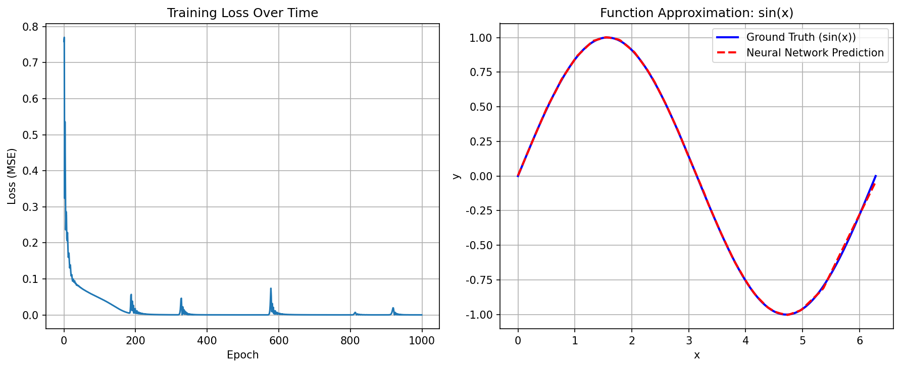

# Chapter 03: Deep Learning with PyTorch

## Theory Summary

This chapter introduces PyTorch as a practical deep learning (DL) toolkit and covers the core concepts a practitioner needs to build, train, and monitor neural networks. The material focuses on tensors, automatic differentiation (autograd), module design (nn.Module), loss functions and optimizers, and monitoring tools like TensorBoard. The chapter also highlights historical context (dynamic vs static computation graphs) and practical API notes relevant to PyTorch 2.x.

### 1. Tensors — the building block

- Definition: In PyTorch a tensor is a multi-dimensional array (generalization of scalars, vectors, matrices, etc.). While mathematical tensors have more rigorous meaning, DL tensors are arrays with specific memory layout and dtype.
- Dtypes: PyTorch supports many dtypes (float16/bfloat16, float32, float64, complex types, integer types, boolean, and quantized types). Default for DL is usually float32; float16/bfloat16 are used for memory/speed tradeoffs.
- Creation: Tensors are created by constructors (e.g., torch.FloatTensor), factory functions (torch.zeros, torch.ones, torch.randn), or by converting NumPy arrays (torch.tensor(numpy_array, dtype=...)).
- Scalar tensors: zero-dimensional tensors exist and can be converted to native Python values via .item().
- In-place vs functional ops: In-place methods have trailing underscore (e.g., .zero_()) and modify tensors in-place — memory-efficient but potentially error-prone.

### 2. Devices and GPU tensors

- Backends: PyTorch abstracts computation devices as "backends" (cpu, cuda, mps, etc.). Use .to(device) or torch.device('cuda:0') to move tensors and models between devices.
- Transparent operations: Most tensor ops have CPU/GPU implementations; behavior is chosen by tensors' device.

### 3. Autograd and gradients

- Dynamic computation graph: PyTorch records operations performed on tensors to build a dynamic computation graph. Calling .backward() on a scalar output backpropagates through this graph, computing gradients for leaf tensors with requires_grad=True.
- Tensor attributes: .grad contains accumulated gradients, .is_leaf indicates leaf tensors, and .requires_grad indicates if gradients are tracked. Use .retain_grad() on non-leaf nodes to keep their gradients when needed.
- Gradient accumulation: gradients accumulate in .grad; you need to zero them (optimizer.zero_grad() or param.grad.zero_()) between optimization steps.
- Historical note: Variables wrapper removed — tensors now carry gradient metadata directly (post 0.4.0).

### 4. Neural network building blocks (torch.nn)

- Modules: nn.Module is the base class for layers and models, providing utilities for parameter management, moving to devices, serialization, and applying transformations.
- Common layers: nn.Linear, activation functions (ReLU, Softmax), Dropout, etc. Use nn.Sequential for quick pipelines.
- Custom modules: subclass nn.Module, register submodules in __init__ by assigning them to attributes, and implement forward(self, x) for transformation logic.
- Model serialization: state_dict() and load_state_dict() for saving/restoring parameters.

### 5. Loss functions and optimizers

- Losses: implemented as nn.Module subclasses. Common: nn.MSELoss (regression), nn.BCELoss / nn.BCEWithLogits (binary classification), nn.CrossEntropyLoss / nn.NLLLoss (multi-class classification).
- Optimizers: implemented in torch.optim (SGD, RMSprop, Adagrad, Adam). They modify parameters passed to them via .step() and expose .zero_grad() utilities.
- Training loop blueprint: for batch in data: predictions = net(batch_x); loss = loss_fn(predictions, batch_y); loss.backward(); optimizer.step(); optimizer.zero_grad().

### 6. Monitoring and TensorBoard

- Need: track loss, validation metrics, gradient statistics, learning rates, sample outputs, and resource usage during training.
- TensorBoard: PyTorch provides torch.utils.tensorboard to write TensorFlow-compatible event logs. SummaryWriter handles logging of scalars, histograms, images, and text.

## Code Implementation Breakdown

The example script `chapter_03_pytorch_basics.py` is an educational, runnable script that demonstrates the concepts above in a compact workflow. Major parts:

1. Imports and setup

- Imports torch, torch.nn, torch.optim, numpy, matplotlib.
- Configures Matplotlib backend (Agg) and fonts for headless rendering.

2. Tensor demonstrations

- Shows construction from lists and numpy, random initialization, zeros/ones, and basic tensor ops (addition, element-wise multiplication, dot, mm).

3. Autograd example

- Creates tensor x with requires_grad=True and computes y = x**2 + 3*x + 1; calls y.backward() and inspects x.grad to validate derivative 2*x + 3.

4. Neural network (SimpleNet)

- Defines class SimpleNet(nn.Module) with three Linear layers and ReLU activations.
- forward passes input through layers and returns output.
- Instantiates the network and prints architecture.

5. Training utilities

- criterion = nn.MSELoss() and optimizer = optim.Adam(net.parameters(), lr=0.001).
- generate_data() creates x in [0, 2π] and y = sin(x).
- train_network() runs training loop: forward, compute loss, backward, optimizer.step(), optimizer.zero_grad(), logs loss every 200 epochs.

6. Training run and visualization

- Trains SimpleNet on sin(x) for 1000 epochs, evaluates on test set, saves plots (loss curve and predictions vs ground-truth) to `chapter_03_results.png`, and reports final MSE.

7. Connection to RL

- Explains mapping of tensors, autograd, nn.Module, optimizers, and loss functions to RL primitives: states, actions, Q-values, policy/value networks, and policy-gradient objectives.

## Connection Between Theory and Code

- Tensors: All data (training inputs, model parameters, and predictions) are represented as torch.Tensors in the code, illustrating creation (torch.tensor, torch.linspace), device-agnostic design, and dtype control.

- Autograd: The `requires_grad=True` flag on tensors and calling `loss.backward()` in `train_network()` demonstrates automatic differentiation, with gradients accumulated into parameter tensors used by the optimizer.

- nn.Module and custom models: `SimpleNet` subclasses `nn.Module` following the recommended pattern: registering submodules in __init__ (fc1, fc2, fc3) and implementing `forward()` to define the computation. This maps directly to the PDF's explanation of modules and forward semantics.

- Loss and Optimizer: The script uses `nn.MSELoss()` and `optim.Adam()` to compute the regression loss and update parameters, following the training loop blueprint in the PDF. `optimizer.zero_grad()` is called before `loss.backward()` to prevent gradient accumulation across steps.

- Monitoring and Visualization: The code saves plots and prints training progress, matching the chapter's emphasis on monitoring; TensorBoard usage is described in the PDF and referenced in the code comments as a recommended tool for richer monitoring.

