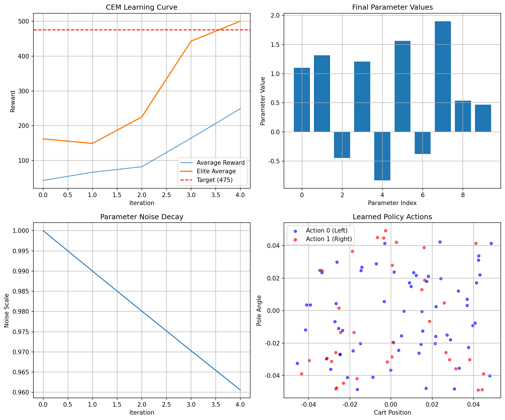

# Chapter 04: The Cross-Entropy Method

## Theory Summary

The Cross-Entropy Method (CEM) is a population-based, gradient-free optimization technique that can be applied to reinforcement learning by treating policy search as a black-box optimization problem over policy parameters. This chapter explains the practical steps of CEM, situates it within RL taxonomies (model-free, policy-based, on-policy), and provides intuition and some theoretical context for why it works.

### 1. Where CEM fits in RL

- Model-free: CEM does not build an explicit model of environment dynamics; it directly searches for good policies.
- Policy-based: CEM optimizes parameters of a policy, which maps observations to action probabilities or decisions.
- On-policy: CEM requires fresh data generated by the current policy distribution; it cannot safely learn from off-policy historical data.

### 2. Algorithmic idea (practical description)

- Consider a parametric policy π_θ(a | s) with parameters θ.
- Maintain a distribution over θ (usually Gaussian with mean μ and diagonal covariance σ^2).
- Iteratively:
  1. Sample N parameter vectors θ_i ∼ N(μ, diag(σ^2)).
  2. For each θ_i, evaluate its performance by running episodes in the environment, obtaining return R(θ_i).
  3. Select a subset of elite parameters — those with top returns (e.g., top 20%).
  4. Update μ and σ using the elite samples (e.g., μ ← mean(elite), σ ← std(elite)).
  5. Optionally decay exploration noise (σ := σ * decay).
- Repeat until desired performance.

Why this works (intuition): By iteratively shifting the sampling distribution toward regions of parameter space associated with higher reward, CEM concentrates sampling where good solutions lie. The maximum likelihood update of μ given elite samples can be seen as a policy-improvement step in parameter space.

### 3. Practical details and hyperparameters

- N (samples per iteration): Larger values improve exploration but cost more episodes.
- Elite ratio / k (how many elites): Balances between selective pressure and diversity; common values range from 10–30%.
- Noise scale and decay: Controls exploration magnitude and annealing schedule; a decaying σ helps refine the solution.
- Evaluation episodes per θ: Usually a small number (1–5) in deterministic or low-variance settings, more in stochastic environments.

### 4. Strengths and limitations

- Strengths:
  - Simplicity and ease of implementation.
  - Works with non-differentiable policies.
  - Can be robust when parameter space is modest.
- Limitations:
  - Sample inefficient compared to gradient-based methods.
  - Scales poorly to high-dimensional parameter spaces.
  - May get stuck in local optima if elite selection is too aggressive.

### 5. Applications and comparison

- Good for initial policy search, hyperparameter tuning, and environments with cheap simulators.
- Use as baseline for comparison with gradient-based approaches (DQN, policy gradients, actor-critic).

## Code Implementation Breakdown

The provided script `chapter_04_cross_entropy_method.py` implements both a linear policy and a full CEM optimizer for the CartPole-v1 environment. Key components:

1. LinearPolicy class

- Parameters: weights (state_dim × action_dim) and bias (action_dim). Flattened parameterization via `get_parameters()` and `set_parameters()` enables black-box sampling and easy parameter updates.
- get_action: computes logits = state @ weights + bias, then either argmax (deterministic) or samples from softmax probabilities.
- softmax: numerically stable softmax implementation (subtracts max logits before exponentiation).

2. Evaluation utilities

- evaluate_policy: runs episodes deterministically (argmax) to estimate the mean return of a given parameter vector.
- Handles Gymnasium (Gym) API (state, _ = env.reset(); env.step returns terminated/truncated flags).

3. CrossEntropyMethod class

- Initialization: sets parameter mean (zeros) and std (noise_scale), calculates parameter dimensionality, and sets n_elite = int(n_samples * elite_ratio).
- sample_parameters: draws N samples from per-parameter independent Gaussians (mean μ, std σ).
- evaluate_samples: for each parameter vector, uses LinearPolicy to set parameters and calls evaluate_policy to get a reward.
- select_elites: sorts rewards and picks top n_elite parameter vectors and their rewards.
- update_distribution: computes new μ and σ from elite samples (mean and std), adds small epsilon for stability, and multiplies σ by noise_decay.
- train: drives the CEM loop—sampling, evaluating, selecting elites, updating distribution, logging progress, and checking for convergence.
- get_best_policy: returns a LinearPolicy with current mean parameters.

4. Training orchestration

- Creates a CEM optimizer with default hyperparameters (n_samples=50, elite_ratio=0.2, noise_scale=1.0, noise_decay=0.99).
- Calls cem.train with max_iterations and a target reward (e.g., 450 or 475) and captures statistics.
- Visualization: plots reward history, parameter means, noise evolution, and learned action distribution (cart position vs pole angle).

## Connection Between Theory and Code

- Distributional parameter search: The code maintains μ and σ (param_mean, param_std) corresponding exactly to the theoretical Gaussian distribution over θ. Sampling θ_i from `np.random.normal(self.param_mean, self.param_std)` implements the theoretical step.

- Evaluation and selection: The `evaluate_samples` and `select_elites` functions implement running episodes for each sample and keeping the top-performing parameter sets according to the percentile-based rule described in the text.

- MLE update: `update_distribution` replaces the theoretical maximum-likelihood estimation of the parameter distribution (conditioned on elite samples) with simple empirical mean and standard deviation of elites—this is a direct implementation of the textbook update.

- Hyperparameters mapping: The script exposes n_samples, elite_ratio, noise_scale, and noise_decay—these correspond to theoretical parameters controlling exploration, selection pressure, and annealing.

- Visualization and diagnostics: The plotting of reward curves and parameter evolution implements the chapter’s recommendation to monitor mean reward, reward boundary, and other diagnostics. The code additionally demonstrates action scatter for qualitative inspection of learned policies.

