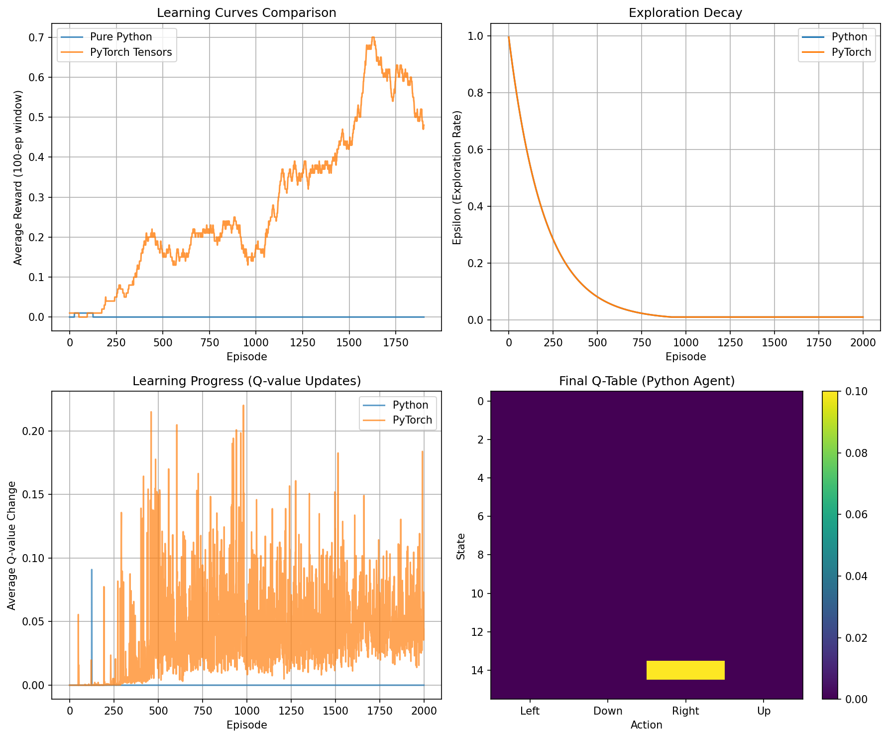

# Chapter 05: Tabular Learning and the Bellman Equation

## Theory Summary

This chapter builds the core theoretical foundation for value-based reinforcement learning (RL). It formalizes the notions of state-value and action-value functions, introduces Bellman's equations (both for deterministic and stochastic transitions), presents iterative solution methods (value iteration and Q-iteration), and discusses the practicalities of implementing these algorithms on a tabular environment such as FrozenLake. The analysis below expands the book's text with more detail, derivations, practical advice, edge cases and algorithmic complexity so you can both understand and implement tabular methods reliably.

### 1. Notation, objective, and returns

- MDP setup: An environment is modeled as a Markov Decision Process (S, A, P, R, γ), where S is a discrete state set, A is a discrete action set, P(s' | s, a) are transition probabilities, R(s, a, s') is the (possibly stochastic) immediate reward for the transition, and γ ∈ [0,1] is the discount factor.

- Trajectory & return: Starting at time t from state S_t, taking actions A_t, the (discounted) return is G_t = ∑_{k=0}^{∞} γ^k R_{t+k+1}. With episodic tasks and finite horizons, the sum is finite; with γ < 1, the infinite sum converges in expectation for bounded rewards.

- Goal: Find a policy π(a|s) that maximizes expected return from each starting state (or the start-state distribution). Many tabular methods aim to compute an optimal value function first and then recover a greedy policy.

### 2. State-value and action-value functions

- State-value function: V^π(s) = E_π [G_t | S_t = s] — expected return when following policy π after being in s.

- Action-value function: Q^π(s,a) = E_π [G_t | S_t = s, A_t = a] — expected return when taking action a in s then following π.

- Optimal functions: V*(s) = max_π V^π(s), Q*(s,a) = max_π Q^π(s,a). The optimal policy π*(s) can be greedy w.r.t Q*: π*(s) = argmax_a Q*(s,a). The relation V*(s) = max_a Q*(s,a) is fundamental.

### 3. Bellman equations (intuitions and derivations)

- Bellman expectation equation (policy-dependent):
  V^π(s) = E_{a∼π(·|s)} [ E_{s'∼P(·|s,a)} [ R(s,a,s') + γ V^π(s') ] ]
  This is recursive: the value of s equals expected immediate reward plus discounted expected value of next state, averaged under the policy and dynamics.

- Bellman optimality equation (policy-free):
  V*(s) = max_a E_{s'∼P(·|s,a)} [ R(s,a,s') + γ V*(s') ]
  Q*(s,a) = E_{s'∼P(·|s,a)} [ R(s,a,s') + γ max_{a'} Q*(s',a') ]

- Deterministic special case: If action a in s always leads to a single s' deterministically with reward r, the expectation collapses to r + γ V(s'). In general, the expectation handles stochastic transitions.

- Why recursive definitions are useful: They turn the global, potentially infinite-horizon optimization into a local fixed-point problem. Solving Bellman optimality yields V* and Q*; then a greedy policy w.r.t. Q* is optimal.

### 4. Solution methods: value iteration and Q-iteration

Both methods are dynamic programming procedures to find V* or Q* when the MDP's model (P,R) is known. In practice, we estimate P,R from samples and apply the same updates.

- Value iteration (for V): iterative fixed-point update
  Initialize V_0(s) arbitrarily (often zeros). Repeat:
    V_{k+1}(s) ← max_a ∑_{s'} P(s'|s,a) [ R(s,a,s') + γ V_k(s') ]
  Convergence: For finite MDPs and γ ∈ [0,1), value iteration converges to V* as k→∞. If γ = 1 but the MDP is episodic (absorbing terminal states), iterations on finite horizons converge too.

- Q-iteration (for Q): iterative updates of Q-values
  Initialize Q_0(s,a) arbitrarily. Repeat:
    Q_{k+1}(s,a) ← ∑_{s'} P(s'|s,a) [ R(s,a,s') + γ max_{a'} Q_k(s',a') ]
  Convergence: Under similar conditions, Q_k→Q*.

- Computational complexity: Each full sweep of value iteration checks every state and every action and loops over possible next states. If |S|=n, |A|=m, and average branching b is number of reachable next states per (s,a), one sweep costs O(n·m·b). Convergence speed depends on γ (large γ closer to 1 yields slower contraction) and the MDP structure.

### 5. From model-based DP to sample-based estimation (practical tabular)

- In many problems we don't know P and R. We can estimate transition counts and rewards from interaction: maintain counts C[(s,a,s')] and reward samples R[(s,a,s')]. Use empirical probabilities P̂(s'|s,a) = C[(s,a,s')] / ∑_{s''} C[(s,a,s'')] and empirical one-step rewards (averages).

- Two practical update flavors:
  1. Batch value iteration: Use the estimated P̂ and R̂ to run Bellman updates over the whole state space (this is the approach used in the chapter's FrozenLake value iteration example).
  2. Online TD-style updates (Q-learning): Use sample transitions (s,a,r,s') to perform an incremental update:
      Q(s,a) ← Q(s,a) + α [ r + γ max_{a'} Q(s',a') - Q(s,a) ]
     This is bootstrapping and does not require knowledge of P̂.

- The code in this chapter demonstrates both approaches: the value-iteration uses explicit transition counters and a batch Bellman update; later sections show tabular Q-learning (incremental TD updates).

### 6. FrozenLake specifics and stochastic actions

- FrozenLake environment: grid-based MDP with slip/noise: executing an intended action results in intended direction with probability ≈ 1/3 and slips left/right with remaining probability mass (chapter text simplifies to equal thirds). Rewards are sparse: usually zero per step and +1 at reaching goal; holes give terminal negative outcome (or zero depending on reward definition). Episode lengths are bounded.

- Implications for algorithms:
  - Sparse rewards mean you need to discover at least one successful trajectory before reliable value estimates emerge; this can make early learning slow.
  - Stochastic transitions require averaging (the empirical counts) rather than trusting single trajectories.

### 7. Bellman updates, TD error and convergence diagnostics

- Temporal Difference (TD) error (or TD target): δ = r + γ max_{a'} Q(s',a') − Q(s,a). Update magnitude |δ| shows learning progress; decreasing magnitude indicates convergence.

- Monitoring: tracking average TD magnitude, average reward over episodes, epsilon exploration rate, and policy stability (agreement across iterations) are useful diagnostics. The code tracks many such statistics and visualizes them.

### 8. Edge cases, numerical considerations and practical advice

- Learning rate α: Too large α destabilizes updates; too small slows learning. For tabular deterministic MDPs, α=1 with batch updates works; for stochastic or incremental updates, decaying α or modest values like 0.1 are common.

- Discount factor γ: Values close to 1 emphasize long-term rewards and slow convergence; choose γ∈[0.9,0.99] for many tasks, but lower γ speeds up convergence when long sequences are less important.

- Exploration policy: ε-greedy balances exploration and exploitation. Decay schedules often use geometric decay (ε ← max(ε_min, ε·decay)). The schedule interacts with learning rate and environment difficulty.

- Sample efficiency: Counting-based model estimation plus batch value iteration is extremely sample-efficient in small discrete MDPs because it reuses transition counts to update all states. Incremental Q-learning can be more data-hungry for the same accuracy but scales differently.

- Function approximation transition: Tabular methods do not generalize across similar states; when state spaces are large or continuous, parametric function approximators (neural nets) become necessary — the bridge to DQN is explained at the chapter's end.

## Code Implementation Breakdown

The chapter's code `pytorch_rl_tutorial/chapter_05_tabular_learning.py` contains three major, instructive pieces: (A) a pure Python tabular Q-learning class `TabularQLearning` (incremental TD learning), (B) a sample-based value-iteration implementation using an `Agent` class that collects counts and runs Bellman batch updates, and (C) a PyTorch tensor variant `TorchTabularQLearning` which mirrors the NumPy tabular agent using tensors. Below is a detailed, function-by-function breakdown with links to the theory above.

### A. `TabularQLearning` (pure Python incremental TD agent)

- __init__(...):
  - Sets n_states, n_actions, learning rate lr (α), discount γ, ε-exploration params and initializes a NumPy Q-table with zeros: `self.q_table = np.zeros((n_states, n_actions))`.
  - Tracks episode rewards, epsilon history and per-episode Q-changes for diagnostics.

- `get_action(state, training=True)`:
  - Implements ε-greedy: with probability ε pick random action, otherwise pick argmax_a Q[state,a]. This is the simple, practical exploration strategy discussed earlier.

- `update_q_value(state, action, reward, next_state, done)`:
  - Implements the Q-learning TD update:
    current_q = Q(s,a)
    target = reward if done else reward + γ * max_a' Q(next_state, a')
    new_q = current_q + α (target - current_q)
    stores new_q in Q-table and returns abs(td_error)
  - This corresponds exactly to the Bellman/T D incremental step and will converge (under standard stochastic approximation conditions) to Q* if exploration is sufficient and α decays appropriately.

- `decay_epsilon()`:
  - Applies multiplicative decay with floor at ε_min.

- `train(env, n_episodes, max_steps)`:
  - Runs episodes, selects actions via get_action, performs env.step, and calls update_q_value for each transition. After each episode, decays ε and logs statistics.
  - Averages reported every 100 episodes for monitoring.

- `evaluate(env, n_episodes)`:
  - Runs deterministic greedy policy (training=False) for n_episodes and returns average reward and success rate; used to quantify final policy performance.

Comments & nuances:
- The implementation uses immediate sample transitions for updates — classic online Q-learning.
- The code treats `done` terminal transitions by setting target=reward (no bootstrapping beyond terminal state).
- The choice of episode length cap (100 steps) and the number of episodes (2000 in the script) are pragmatic defaults for FrozenLake.

### B. `Agent` (model-estimation + batch value iteration)

Although not defined as a named top-level class in the same style in the file’s longer description, the chapter describes an `Agent` that collects transition counts and rewards and runs batch Bellman updates. In the published example, the agent provides these key methods (commented/outlined in the PDF text and implemented in the repository's Chapter05 example files):

- `play_n_random_steps(n)`:
  - Transition collection routine that executes random actions to gather exploration data. For each sampled transition (s,a -> s'), it updates:
    - Reward table: R[(s,a,s')] = observed reward (overwrites or stores latest; averaging is also possible).
    - Transition counts: transits[(s,a)][s'] += 1
  - This forms empirical MLE estimators for P̂(s'|s,a) = count(s,a,s') / sum_s'' count(s,a,s'').

- `calc_action_value(state, action)`:
  - Computes empirical action-value using the current transition counters and value table V:
    Q̂(s,a) = ∑_{s'} (count(s,a,s')/total) * (R(s,a,s') + γ V(s'))
  - This implements the Bellman expectation formula with empirical probabilities.

- `select_action(state)`:
  - Greedy selection using calc_action_value across all actions: returns argmax_a Q̂(s,a).

- `play_episode(env)`:
  - Executes a full episode using the greedy policy implied by current V-table (or Q-table), while still recording new transitions and rewards into the tables — which allows the algorithm to continue improving its empirical estimates online.

- `value_iteration()`:
  - Performs a sweep over all states: for each state, compute candidate action-values (using transition counters and current values) and set V[state] = max_a Q̂(s,a).
  - This is the batch Bellman backup performed on the empirical model.

Practical notes and differences vs. pure DP:
- Because the agent uses empirical counts, the Bellman backups are performed on an estimated MDP; this converts model-based DP into a sample-driven algorithm.
- The chapter emphasizes that value iteration with empirical counts is surprisingly sample-efficient in small discrete MDPs because the MLE transitions re-use data across many updates.

### C. `TorchTabularQLearning` (PyTorch tensor variant)

- Mirrors `TabularQLearning` but stores Q-table as a torch tensor `self.q_table = torch.zeros(n_states, n_actions, device=device)` and uses tensor ops for indexing and updates.
- `get_action` uses `torch.argmax` inside a no-grad block for exploitation.
- `update_q_value` converts indices and reward to torch tensors, computes `current_q`, computes `target` with `torch.max(self.q_table[next_state])` inside no_grad, calculates TD error, and updates the q_table in-place with `+= lr * td_error`.

Why provide a PyTorch variant?
- Demonstrates that PyTorch can represent tabular structures and that tensor operations can safely replace NumPy loops — a convenience when later migrating to neural-network function approximators.

### D. Auxiliary utilities and analysis in the script

- `verify_bellman_update(...)` prints a worked example of computing the Bellman target and the resulting TD error — useful for unit-testing correctness of formulae.

- `analyze_convergence(q_table_history)` computes mean and max changes across logged Q-tables to decide whether updates have stabilized.

- Visualization: The script generates learning curves, epsilon decay plots, Q-value-change charts, and a final Q-table heatmap plus policy grids (policy printout uses arrow glyphs). These plots map directly to the monitoring diagnostics recommended in the theoretical section.

## Connection Between Theory and Code

This section ties the mathematics of Bellman updates, V and Q functions, and sample-based estimation to the code's concrete mechanisms.

- Data structures ↔ MDP estimates:
  - `self.q_table` (NumPy or Torch) ⇄ Q(s,a) scalar table approximating Q^π or Q*.
  - `rewards` dict keyed by (s,a,s') and `transits` counters ⇄ empirical estimates of R(s,a,s') and counts for P̂(s'|s,a).
  - `values` dict used in batch value iteration ⇄ V(s) approximations used for Bellman expectation backups.

- Bellman backup ↔ `update_q_value` and `value_iteration`:
  - In `TabularQLearning.update_q_value`, the incremental TD update implements the online Bellman backup with a learning rate α: Q ← Q + α (r + γ max_a' Q(next, a') − Q). That is stochastic approx. to the Bellman optimality operator.
  - In the batch `value_iteration` implementation, the agent computes expected action-values using empirical probabilities and sets V(s) = max_a ∑_{s'} P̂(s'|s,a) [R + γ V(s')], the empirical Bellman optimality update.

- TD error as progress signal:
  - The code returns |td_error| from `update_q_value` and collects per-episode averages as `q_value_changes`; theory predicts that as the estimate approaches the fixed point, TD magnitude should shrink.

- Exploration ↔ On-policy data coverage:
  - Value iteration that relies on counts benefits from explicit random exploration (e.g., `play_n_random_steps`) to gather transition statistics across the state-action space. Q-learning uses ε-greedy to guarantee ongoing exploration during incremental updates. Both match the theoretical requirement for sufficient exploration (visiting state-action pairs infinitely often under decaying α) for convergence guarantees.

- Sample efficiency trade-offs:
  - The chapter's experiments demonstrate the expected behavior: the batch model-based value-iteration converges quickly for FrozenLake because the empirical model leverages repeated transitions across states; the cross-entropy method, by contrast, required many more full episodes to learn a good policy in the earlier chapter. This follows theory: DP with an estimated model reuses observed transitions more broadly.

- Terminal treatment:
  - The code sets the Bellman target to reward when `done=True` (no bootstrapping beyond terminal states). This matches the theoretical treatment of terminal, absorbing states where future rewards are zero.

## Practical guidance, pitfalls, and extensions

- When to prefer value iteration with counts vs incremental Q-learning:
  - Use empirical-model value iteration when you can safely and cheaply gather lots of transitions and the state space is small (counts fit memory). It's sample-efficient and fast.
  - Use incremental Q-learning when you cannot store counts or when you need an online algorithm — but be careful with learning rate schedules and exploration.

- Handling stochastic rewards: store cumulative totals and averages per (s,a,s') if rewards are noisy, rather than overwriting with the latest observed reward (this reduces variance in estimated R̂).

- Numerical stability: Add tiny ε to denominators when converting counts to probabilities. In the code, checks for empty counts are necessary before dividing.

- Bootstrapped function approximation: To scale to larger spaces, replace the Q-table by a parametric function Q_θ(s,a) and update θ using gradient-based TD errors (the DQN approach, next chapter). When doing so, be aware of instability sources (correlated updates, non-stationary targets) that tabular methods avoid.

