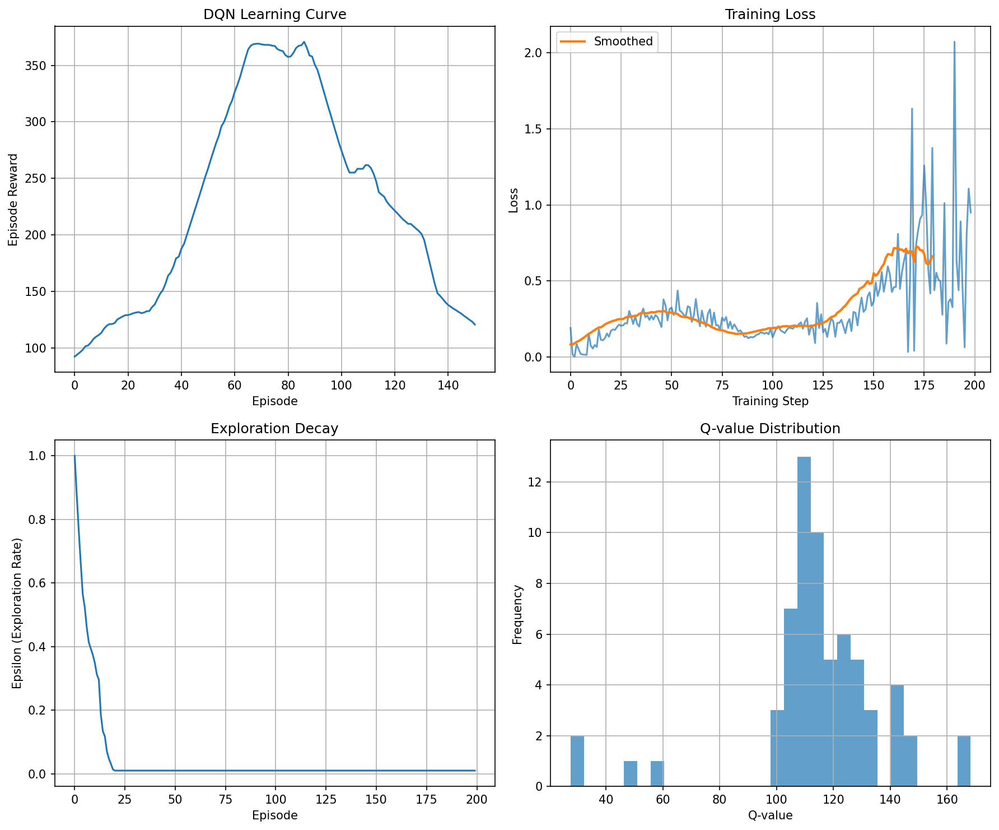

# Chapter 06: Deep Q-Networks (DQN)

## Theory Summary (extended)

This chapter introduces Deep Q-Networks (DQN) — the combination of Q-learning with deep neural network function approximation — and explains the algorithmic and engineering practices that make DQN work reliably for high-dimensional inputs such as raw Atari frames. The following expanded summary covers the core theory (Bellman operators, off-policy learning), practical stability issues (non-iid data, moving targets), and the important engineering solutions (experience replay, target networks, preprocessing). It also includes practical hyperparameter choices and diagnostic guidance.

1) Motivation and problem formulation

- Tabular Q-learning solves small discrete MDPs by storing a table Q(s,a). For high-dimensional observations (images, continuous states), a table is infeasible. DQN replaces the Q-table with a parameterized function Q(s,a; θ), typically a convolutional neural network for raw images.

- Objective: find θ that minimizes the Bellman error across transitions sampled from environment (or replay buffer):
  L(θ) = E_{(s,a,r,s')∼D} [(Q(s,a; θ) − y)^2],
  where y = r + γ max_{a'} Q(s',a'; θ−) (θ− represents target network parameters).

- Note on off-policy vs on-policy: DQN is an off-policy method in that it learns from data generated by past policies (stored in replay buffer) while updating toward the greedy policy under the current network.

2) Key theoretical ingredients and pitfalls

- Bootstrapping: using current estimates to compute targets (r + γ max_a' Q(s',a')) introduces non-stationarity because both the predictions and the targets depend on θ. When combined with correlated sequential data and function approximation, this leads to instability.

- Non-iid data: frames observed sequentially are highly correlated; SGD assumes (approximately) iid samples. Correlated updates amplify variance and bias of gradient estimates, harming convergence.

- Overestimation bias: the max operator applied to noisy estimates tends to positively bias the target (the argmax tends to pick the overestimated action). This can be partly mitigated (later chapters) via Double DQN.

3) Practical stability fixes (why they work)

- Experience Replay Buffer:
  - Stores recent transitions and samples uniformly at random to break temporal correlations.
  - Enables multiple reuses of transition data, improving sample efficiency.
  - Acts as an empirical approximation to some stationary distribution D used to compute expectations in the loss.

- Target Network (θ−):
  - Maintain a separate set of parameters θ− for computing the target y.
  - θ− is updated to θ every N steps (hard update) or slowly (soft update). This reduces moving-target instability because the target is computed with a network that changes infrequently.

- Frame stacking, preprocessing, and clipping:
  - Stack k recent frames to recover information about velocity (partially addressing POMDP issues).
  - Convert frames to grayscale and resize to 84×84 to reduce dimensionality and computational load.
  - Clip/scale rewards to keep gradients in a stable range across games with different reward scales.

- Loss choices and gradient clipping:
  - Huber (smooth-l1) loss is less sensitive to outliers than MSE and stabilizes training.
  - Gradient clipping prevents exploding gradients and stabilizes updates when using big networks and non-stationary targets.

4) The DQN learning algorithm (summary)

1. Initialize Q-network parameters θ and target network θ− ← θ.
2. Initialize replay buffer D.
3. For each step:
   a. Select action a with ε-greedy policy from Q(·; θ).
   b. Execute a, observe r and s'.
   c. Store (s,a,r,s',done) in D.
   d. Sample random minibatch from D.
   e. Compute targets y = r + γ (1 − done) max_{a'} Q(s',a'; θ−).
   f. Compute loss L = mean ( Q(s,a; θ) − y )^2 (or Huber loss).
   g. Perform gradient descent on θ to minimize L.
   h. Every C steps, update θ− ← θ.

5) Hyperparameters and practicalities (guidance)

- Replay buffer size: Large buffers (1M transitions in DeepMind) improve stability but use a lot of memory. For Pong, smaller buffers (10k) are often enough.
- Batch size: 32 is standard; larger batches reduce variance but increase memory and latency.
- Learning rate and optimizer: Adam with small LR (1e-4) is common.
- Epsilon schedule: decay from 1.0 to ~0.01 over hundreds of thousands of frames (shorter decays for single-game experiments).
- Target update frequency: 1k–10k steps; too frequent updates lose stability benefits; too rare updates slow learning.
- Reward clipping: clip to −1, 0, 1 for Atari to normalize reward scales across games.

6) Diagnostics and failure modes

- If no positive dynamics for 100k–200k frames: restart training with different random seed or hyperparameters.
- Monitor: mean reward over last 100 episodes, training loss, Q-value distribution, replay usage, and frame-processing throughput (fps).
- Watch for catastrophic divergence (constant low scores): try lower LR, smaller batch, or more conservative epsilon decay.

## Code Implementation Breakdown (detailed)

All code is in `pytorch_rl_tutorial/chapter_06_deep_q_networks.py` with a compact DQN implemented end-to-end, including frame preprocessing, replay buffer, DQN network, DQNAgent wrapper, and training loop. Below is a walk-through mapping each code block to the theory.

1) FrameProcessor (frame preprocessing)

- Methods: `process_frame()` converts RGB→grayscale (cv2.cvtColor), resizes to 84×84, and normalizes to [0,1]. `add_frame()` stacks the last k frames (default 4) and pads with the first frame until buffer is full.

- Theory mapping: Frame stacking addresses partial observability; grayscale + resizing reduces input dimensionality and computation. Stacking axis ordering in the repo matches subsequent conv layers expectation.

2) ReplayBuffer (experience replay)

- Uses a deque to store Experience tuples and `sample()` to return torch tensors of shapes appropriate for batch training.

- Theory mapping: Uniform random sampling from buffer approximates iid sampling of replay data, breaking temporal correlations.

3) DQNNetwork (CNN architecture)

- Conv layers: (8×8 stride 4 → 32 filters), (4×4 stride 2 → 64), (3×3 stride 1 → 64), matching the original DQN paper.
- FC layers: flatten → 512 → n_actions outputs (no activation at final layer).
- Weight init: Kaiming normal for conv and linear layers.
- Forward passes scale Byte inputs by 1/255 inside the network (fast when inputs are ByteTensors).

- Theory mapping: the network maps stacked frames to Q-values for all actions in a single forward pass — efficient and aligns with the DQN objective.

4) DQNAgent

- Components: q_network, target_network, optimizer (Adam), replay_buffer, epsilon params, batch_size, target_update_freq, device.
- `get_action()` implements ε-greedy selection with network inference under no_grad.
- `store_experience()` pushes transition to buffer.
- `train_step()` encapsulates: sample batch, compute current_q (gather on action indices), compute next_q via target_network (detach), mask terminal states, compute Huber loss, backpropagate, clip gradients, optimizer.step(), periodic target update, decay epsilon.

- Implementation details mapping to theory:
  - `gather(1, actions.unsqueeze(1))` selects chosen-action Q(s,a) from network outputs — vectorized and differentiable.
  - `next_q_values = target_network(next_states).max(1)[0]` computes max_a' Q(s',a'; θ−) with no gradient.
  - `target_q_values = rewards + γ * next_q_values * ~dones` ensures targets are zeroed for terminal transitions (no bootstrap).
  - Huber loss (smooth_l1_loss) stabilizes against outliers.
  - Gradient clipping via `clip_grad_norm_` prevents gradient explosion and keeps updates bounded.

5) Training loop `train_dqn()`

- For each episode: reset environment and frame buffer; iterate up to max_steps; select action and step environment; process next_state via FrameProcessor; store experience; call train_step(); accumulate reward and track losses.
- Logging and checkpointing: every N episodes save model; print average rewards and losses periodically (50 episodes by default here).

- Performance notes: For Atari, it's essential to batch frame conversion, avoid extra copies when converting numpy arrays to tensors, and delay training until buffer has enough samples.

6) Utilities: SimpleDQN for CartPole

- When Atari is unavailable, the script falls back to a simple MLP (`SimpleDQN`) for small state vectors and uses a smaller learning rate and target update frequency suitable for faster experiments.

## Connection Between Theory and Code (explicit mapping)

- Experience replay and non-iid data: `ReplayBuffer.sample()` randomizes batches; training uses these batches in `train_step()` which translates the theoretical iid assumption into practice.

- Target stabilization: `target_network` is updated in `train_step()` every `target_update_freq` steps via `update_target_network()` implementing θ− ← θ behavior.

- Bootstrapping and target computation: `target_q_values` computed using the detached `next_q_values` enforces that the target is not influenced by gradient updates of the current mini-batch; terminal masking `~dones` avoids bootstrapping beyond episode ends.

- Loss and optimization: Huber loss and `optimizer.step()` implement SGD on θ minimizing the empirical Bellman error.

- Frame preproc and stacking: `FrameProcessor` forms states as stacked frames, the CNN `DQNNetwork` consumes these stacked channels and outputs Q-values for all actions in a single forward pass.

- Numerical and implementation safeguards: gradient clipping, proper device handling (CPU/GPU), batch-to-tensor conversion, and periodic checkpointing map to practical concerns discussed in the chapter.

