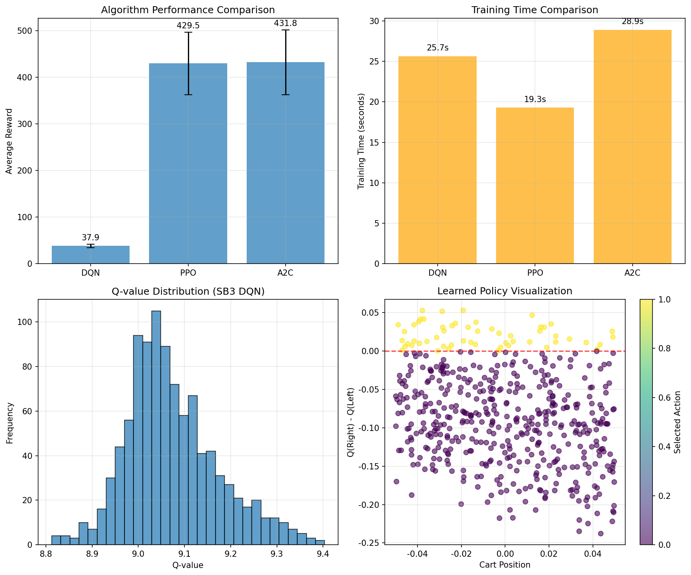

# Chapter 07: Higher-Level RL Libraries (PTAN / Stable Baselines3)

## Theory Summary (extended)

This chapter surveys higher-level Reinforcement Learning (RL) libraries and shows how using well-designed building blocks accelerates experimentation and reduces boilerplate. It focuses on PTAN (a compact, flexible PyTorch helper library) in the book, but the provided code example in this repository uses Stable Baselines3 (SB3) to demonstrate a production-ready workflow. The following expanded summary covers motivations, core abstractions (agents, action selectors, experience sources, replay buffers, target nets, vectorized envs, callbacks), and the trade-offs between direct implementations and high-level libraries.

Why use a high-level RL library?
- Reuse: RL experiments share a lot of plumbing (env wrappers, replay buffers, logging, training loops). Libraries centralize battle-tested code and reduce duplication.
- Reliability: Mature libs implement best practices (stable optimization defaults, numerical safeguards, reproducible pipelines).
- Speed: Faster to test ideas (turn-key training) and compare algorithms across environments.
- Trade-offs: Abstraction may hide details (less educational than building from scratch) and can restrict highly customized research, but most libraries offer extension points.

Key abstractions covered
- Agent / ActionSelector: Decouple model outputs from action choice. Action selectors implement greedy/epsilon-greedy or sampling from a policy distribution. Agents batch inputs for efficiency and may keep internal state (for recurrent agents or noise processes).
- ExperienceSource & ExperienceSourceFirstLast: Provide iterators to convert agent+env interactions into training-ready tuples (s,a,r, s') and n-step variants. They handle episode boundaries and vectorized envs.
- Replay Buffers: Uniform and prioritized buffers (naive O(n) and segment-tree optimized O(log n)). Large-scale buffers require careful memory and indexing strategies, especially for image-based tasks.
- TargetNet: Keeps a separate copy of parameters for stable bootstrap targets. Supports hard sync and soft (alpha) blending.
- Vectorized Environments (VecEnv): Run multiple env instances in parallel for efficient use of CPU/GPU and to increase data throughput.
- Callbacks & Monitoring: Hooks for evaluation, early stopping, checkpointing, TensorBoard logging, and performance metrics (FPS, per-episode rewards).

Common patterns and heuristics
- Decouple data collection from learning: Collect trajectories (via ExperienceSource or VecEnv) and store them in a buffer for randomized sampling.
- Use n-step returns or First-Last wrappers to compute targets directly when needed (simplifies DQN training code and is essential for n-step methods).
- Start training only after buffer is warm enough (learning_starts) to avoid trivial overfitting to initial limited data.
- Use vectorization for CPU-bound environments; use parallel processes for environment stepping when environments contain heavy simulation logic.

When to use PTAN vs newer libraries
- PTAN: Lightweight, PyTorch-first, simple to extend. Great for educational code and flexible research code that needs explicit control while avoiding repetitive plumbing.
- Stable Baselines3: Production-ready, many algorithms implemented, solid callbacks and training utilities. Best for rapid prototyping and benchmarking.
- TorchRL and other modern PyTorch-native libs: Provide more feature-rich building blocks (transformations, replay modules, device-aware dataloaders) and are now recommended for larger projects.

## Code Implementation Breakdown (mapping to `chapter_07_high_level_libraries.py`)

I read `pytorch_rl_tutorial/chapter_07_high_level_libraries.py` and mapped its sections to the chapter concepts. The script demonstrates SB3 usage: creating standard and custom policies, vectorized envs, callbacks, monitoring, training different algorithms, extracting networks, saving/loading models, and simple analysis utilities.

Top-level structure (observed in the file):
- Imports and environment setup.
- Creating a default SB3 `DQN` agent and running a small training run.
- Defining custom architectures (`CustomDQNNetwork`, `CustomFeaturesExtractor`) and using `policy_kwargs` to inject them into SB3.
- Creating vectorized environments with `make_vec_env` and training with parallel envs.
- Demonstrating callbacks and Monitor-based logging for evaluation and early stopping.
- Comparing several algorithms (DQN, PPO, A2C) on the same environment.
- Extracting / analyzing learned networks and saving/loading models.

Detailed walkthrough and key lines

1) Basic SB3 usage and DQN creation
- The script constructs a `gymnasium` env and passes it directly to SB3's `DQN` wrapper.
- Important hyperparameters mirrored from lower-level DQN implementations: `learning_rate`, `buffer_size`, `learning_starts`, `batch_size`, `tau` (for polyak updates; `tau=1.0` maps to hard update), `target_update_interval`, exploration parameters, `train_freq`, and `gradient_steps`.
- This shows how high-level libraries encapsulate the DQN loop: calling `learn(total_timesteps=...)` runs the whole collection→replay→update loop for you.

2) Custom network architectures
- `CustomDQNNetwork` is a PyTorch `nn.Module` that receives the environment `observation_space` and `action_space`. It returns a Q-value per action in `forward()`.
- `CustomFeaturesExtractor` subclasses SB3's `BaseFeaturesExtractor`. SB3 expects a `features_extractor_class` in `policy_kwargs` and will use it to preprocess observations before the policy head.
- The script shows how to pass `policy_kwargs` to inject custom networks, demonstrating the library's extensibility points.

3) Vectorized Environments
- `make_vec_env(env_name, n_envs=n_envs, seed=42)` instantiates a vectorized environment that runs `n_envs` environments in parallel, improving sample throughput.
- Vectorized environments require some hyperparameter adjustments: larger `buffer_size` and care for per-step vs per-environment timesteps.

4) Callbacks and monitoring
- Uses `Monitor` wrapper to persist episode-level logs to disk (compatible with TensorBoard and SB3 evaluation tools).
- `StopTrainingOnRewardThreshold` and `EvalCallback` are composed into a `CallbackList` to periodically evaluate the agent and stop when a desired mean reward is reached.
- These abstractions allow you to keep training code concise while adding robust evaluation and checkpointing.

5) Algorithm comparison
- The example trains DQN, PPO, and A2C on `CartPole-v1` with comparable budgets, collects training times, and evaluates performance with `evaluate_policy`.
- This pattern demonstrates how consistent interfaces across algorithms enable apples-to-apples comparisons with minimal glue code.

6) Model persistence and analysis
- The script demonstrates saving with `.save()` and loading with `DQN.load()`. SB3 persists both model weights and configuration required to reinstantiate policies.
- `analyze_network()` shows a simple way to sample states and inspect network outputs (Q-values), compute statistics and action distributions, and diagnose degenerate behaviors.

## Connection Between Theory and Code (explicit mapping)

- Experience source / Replay buffer: In SB3 the data collection, buffer filling, sampling, and target computation are implemented internally. In the file, `learning_starts` and `train_freq` control when SB3 begins to update and how often it updates, which corresponds to the buffer warmup and sampling cadence in hand-rolled DQN.

- Target networks and tau: Setting `tau=1.0` in SB3 maps to a hard target sync (θ− ← θ every `target_update_interval` steps). Lower `tau` values would enable soft updates.

- Vectorization: `make_vec_env` provides parallelized sampling, approximating multiple independent environment rollouts. This directly implements the theory suggestion to increase data diversity and hardware utilization.

- Callbacks: `EvalCallback` + `StopTrainingOnRewardThreshold` implement evaluation-based early stopping, which is a practical control for avoiding overtraining and for model selection.

- Custom architectures: The `features_extractor_class` and `policy_kwargs` are concrete extension points that map to the theoretical choice of function approximator architecture for Q or policy networks.

