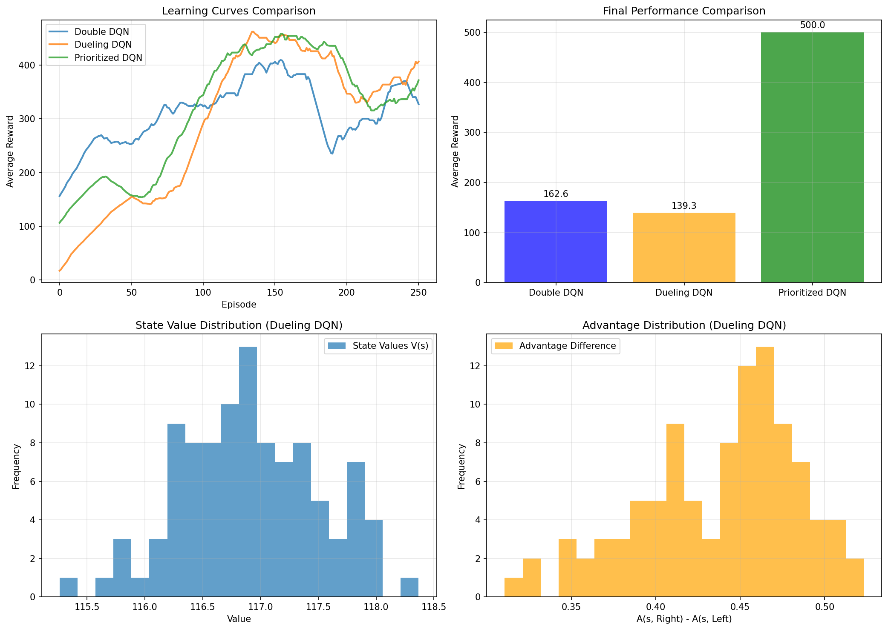

# Chapter 08: DQN Extensions

## Theory Summary (extended)

This chapter surveys practical and widely-used extensions to the original Deep Q-Network (DQN) algorithm that improve stability, sample efficiency, and final performance. Many of these ideas were combined into the Rainbow DQN architecture, but each idea is useful standalone.

Core extensions covered:
- N-step returns: Unroll the Bellman equation for n steps to provide a richer learning signal, reduce variance of targets, and accelerate propagation of rewards.
- Double DQN: Reduce overestimation bias by decoupling action selection and action evaluation when computing targets.
- Noisy Networks: Learn parameterized, trainable noise in network weights to enable efficient exploration without external schedules.
- Prioritized Experience Replay (PER): Sample transitions with probability proportional to TD error magnitude to focus learning on important transitions.
- Dueling DQN: Separate the estimation of state-value V(s) and action-advantage A(s,a) streams and combine them, improving learning in states where action choice matters little.
- Distributional / Categorical DQN: Model the return as a distribution (not just the expectation); this can improve the fidelity of value estimates.

Why these help (intuition):
- N-step returns reduce bootstrapping bias and propagate rewards faster than 1-step updates, at the cost of higher variance for long n.
- Double DQN mitigates the positive bias of the max operator by using the online network to choose actions and the target network to evaluate them.
- Noisy networks internalize exploration, making exploration state-dependent and learnable, often reducing the need for hand-tuned epsilon-schedules.
- PER makes learning concentrate on transitions with large TD error, which speeds up learning but requires importance-sampling weights to correct for sampling bias.
- Dueling architecture learns which states are generally good or bad independently from per-action differences, improving sample efficiency when the advantage signal is sparse.

Hyperparameter and implementation trade-offs:
- PER adds α (prioritization) and β (importance-sampling) hyperparameters and extra data structures (sum tree) for efficient sampling.
- N-step returns add n and require first-last experience handling (consolidating intermediate rewards) used with ExperienceSourceFirstLast patterns.
- Combining methods (e.g., Double + Dueling + PER) often gives large gains but increases implementation complexity.

## Code Implementation Breakdown (mapping to `pytorch_rl_tutorial/chapter_08_dqn_extensions.py`)

I read the chapter PDF and the script. Key components implemented in the script and their mapping to theory are below.

1) File sections and structure
- The script follows a didactic flow: explain DQN limitations, then implement Double DQN, Dueling DQN, and Prioritized Replay with integration and training/plotting code. The environment used for experiments is `CartPole-v1` for faster iteration and visualization.

2) Double DQN
- Class: `DoubleDQNAgent`
- Key methods:
  - `_build_network()` — builds a simple MLP Q-network.
  - `get_action()` — ε-greedy policy for action selection.
  - `train_step()` — samples batch from replay buffer, computes current Q(s,a) via `q_network(states).gather(1, actions.unsqueeze(1))`, computes next actions via `q_network(next_states).argmax(1)`, then evaluates those actions with `target_network(...).gather(1, next_actions.unsqueeze(1))` inside a `torch.no_grad()` block. The target is rewards + γ * next_q * (1 - done).
- Mapping to theory: action selection from the online network and evaluation by the target net implements Double DQN, reducing max-induced overestimation.

3) Dueling DQN
- Classes: `DuelingDQNNetwork`, `DuelingDQNAgent`
- Architecture: shared `feature_layer` → two heads: `value_stream` (outputs V(s)) and `advantage_stream` (outputs A(s,a)). The output Q(s,a) is computed as V + (A - mean(A,axis=1,keepdim=True)).
- Training: same training loop as DQN; can be combined with Double DQN target computation.
- Mapping: Architectural decomposition improves learning when action advantages are small relative to state value.

4) Prioritized Replay
- Data structures: `SumTree` (binary tree storing priorities) and `PrioritizedReplayBuffer` (wraps the SumTree; supports `push()`, `sample(batch_size)` returning weights and indices, and `update_priorities(indices, priorities)`).
- Sampling: stratified sampling by partitioning total priority into segments and uniformly sampling from each segment.
- Importance-sampling weights: weights are computed as (1 / (N * P(i)))^β and normalized by the maximum weight to stabilize learning.
- Agent: `PrioritizedDQNAgent` uses `PrioritizedReplayBuffer` and, after computing TD-errors, updates priorities with `replay_buffer.update_priorities(indices, priorities)`.
- Mapping: PER biases learning toward informative transitions while weights correct gradient estimates to reduce bias.

5) Training harness
- `train_agent(agent, env, n_episodes, max_steps)` — standard episodic loop: select actions, step env, store experiences, call `train_step()`.
- Evaluation & plotting: compare learning curves over episodes; produce histograms and plots to inspect V(s) / A(s,a) for Dueling networks.

Code-level safety and practical touches
- `torch.no_grad()` used when computing target network outputs.
- Gradient clipping via `torch.nn.utils.clip_grad_norm_(...)` to reduce exploding gradients.
- Epsilon decay implemented in agents to anneal exploration.

## Connection Between Theory and Code (explicit mapping)

- Overestimation bias → Double DQN: selecting argmax via `q_network` and evaluating via `target_network` in `train_step()` directly implements the Double DQN correction.
- PER → PrioritizedReplayBuffer and SumTree: stratified sampling, priority update logic, and importance-sampling weight calculation are implemented to match the PER recipe.
- Dueling → DuelingDQNNetwork: V/A streams and combining formula are implemented exactly as described in the literature.
- N-step returns and ExperienceSourceFirstLast: the chapter notes the use of FirstLast experience wrappers to aggregate n-step rewards; the script’s `unpack_batch` functions and common utilities handle terminal-state masking consistent with n-step training.

