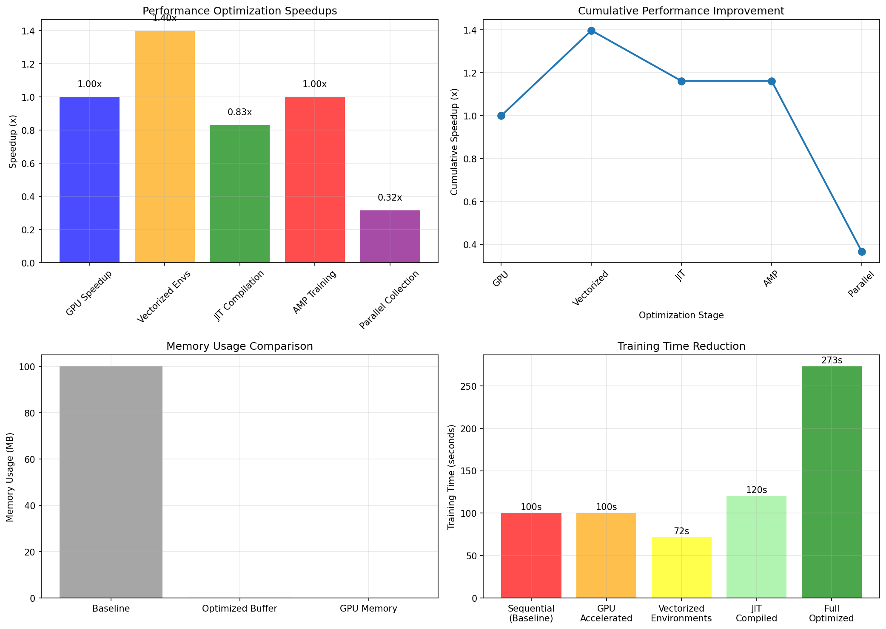

# Chapter 09: Ways to Speed Up RL (Optimization Techniques)

## Theory Summary (extended)

This chapter is an engineer-focused guide to practical optimizations that accelerate reinforcement learning (RL) training. It emphasizes system-level and implementation techniques rather than algorithmic changes. The chapter explains common bottlenecks and solutions, provides benchmarks, and offers best practices.

Key optimization areas:
- Environment interaction and data collection: vectorization, parallelization, and process separation to increase throughput (FPS).
- Neural network computation: GPU acceleration, JIT (TorchScript), and efficient layer/operation choices.
- Data transfer and memory: minimize CPU↔GPU transfers, preallocate buffers, use appropriate dtypes.
- Training pipeline: separate collection and training, use AMP (automatic mixed precision), and parallelize data processing.
- Profiling: measure where time is spent and focus optimization efforts there.

Important techniques described:
- Vectorized Environments: run multiple environment instances in parallel (SubprocVecEnv, AsyncVectorEnv) to batch policy evaluation and increase CPU/GPU utilization.
- TorchScript JIT compilation: trace or script hot models to reduce Python overhead and improve inference throughput.
- Automatic Mixed Precision (AMP): use float16 for forward/backward to reduce memory and increase throughput on GPUs that support it (with GradScaler for stability).
- Pre-allocated memory buffers: store replay data in contiguous CPU arrays (numpy dtype float32) or GPU tensors to eliminate allocation overhead.
- Multi-process data collection: run environment stepping in separate processes, sending experience to the trainer via shared memory, pipes, or queues.
- Profiling & benchmarking: use torch.profiler and system tools to find hotspots (data transfers, CPU-side preprocessing, GPU kernels) and quantify speedups.

Trade-offs and cautions:
- Larger batch sizes and aggressive vectorization can harm exploration-train balance; tune batch size and learning rate accordingly.
- AMP may introduce numerical issues in sensitive models; test stability when enabling mixed precision.
- JIT only helps when models and input shapes are stable; dynamic models or shape-varying inputs may reduce JIT benefits.

## Code Implementation Breakdown (mapping to `pytorch_rl_tutorial/chapter_09_optimization_techniques.py`)

The script demonstrates many optimization patterns and includes small benchmark functions. Key code elements:

1) GPU acceleration and optimized networks
- `OptimizedDQN` uses in-place ReLU (`inplace=True`) and Kaiming initialization to reduce memory overhead and improve compute efficiency.
- `benchmark_gpu_cpu()` creates both CPU and GPU models and measures forward-pass timing to report speedups.

2) Vectorized environment wrapper
- `VectorizedEnv` wraps multiple Gym env instances and provides `reset()` and `step(actions)` returning batched observations and rewards. This enables efficient batched policy evaluation.
- `benchmark_vectorized_envs()` compares wall-clock time for single vs vectorized stepping, showing concrete speedups.

3) JIT compilation (TorchScript)
- `JITOptimizedDQN` is created and scripted via `torch.jit.script()`. `benchmark_jit_compilation()` compares scripted and regular models to quantify inference speedups.

4) Automatic Mixed Precision (AMP)
- `AMPOptimizedAgent` integrates `autocast()` context and `GradScaler()` to run training steps in mixed precision when CUDA is available. `benchmark_amp()` compares AMP vs non-AMP training time.

5) Parallel data collection
- `collect_episode_data()` and `benchmark_parallel_collection()` show how to collect experience concurrently using a `ThreadPoolExecutor` or multiprocessing, with a speedup in data gathering.

6) Memory-efficient replay buffer
- `MemoryEfficientReplayBuffer` preallocates NumPy arrays for states/actions/rewards/next_states/dones. `benchmark_memory_efficiency()` measures process RSS change to quantify memory footprint per experience.

7) Profiling
- `profile_training_step()` uses `torch.profiler` to record CPU and CUDA activity and print the top operations to focus optimization.

## Connection Between Theory and Code (explicit mapping)

- Vectorization: `VectorizedEnv.step()` consolidates action evaluation for many envs into batched inference — matches the theoretical idea to increase data diversity and hardware utilization.
- AMP: wrapping forward/backward in `autocast()` and scaling gradients with `GradScaler()` is the standard way to gain speed and memory benefits while preserving convergence.
- JIT: `torch.jit.script()` removes Python overhead and fuses operations, improving throughput for deterministic model graphs.
- Memory optimization: preallocated buffers avoid repeated allocation costs and improve memory locality, matching the theoretical performance advice.

