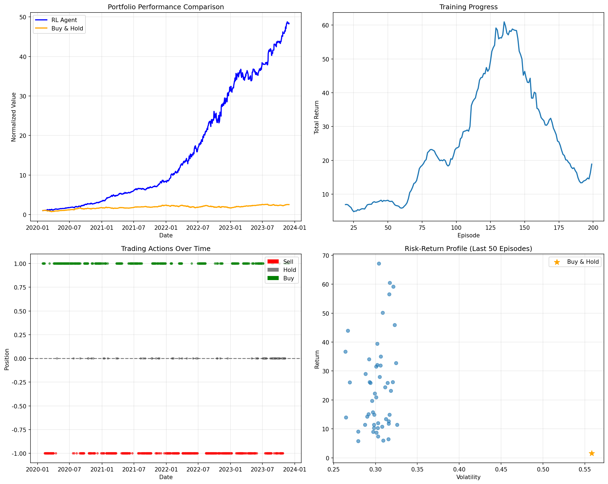

# Chapter 10: Stocks Trading Using RL

## Theory Summary (extended)

This chapter walks through applying reinforcement learning (RL) techniques — particularly DQN-style agents — to an applied domain: stock trading. The chapter focuses on how to model the trading problem as an RL environment, data collection and preprocessing, reward design, risk considerations, and practical backtesting.

Core components of the trading RL setup:
- Environment and observation design: Decide which market features (prices, returns, technical indicators) and lookback windows to provide. Represent data as relative returns to improve generalization across instruments.
- Action space: Discrete (Buy/Hold/Sell) or continuous (position sizing in [-1, +1]). This script uses discrete actions mapped to continuous positions for the environment.
- Reward design: Immediate step rewards vs reward-on-close; risk-adjusted reward (Sharpe-like) can stabilize learning. Transaction costs and slippage must be included to avoid unrealistic strategies.
- Data splits: Train/validation/test splits by time (e.g., 2016 train, 2015 validation) to avoid lookahead bias. Watch for survivorship bias in datasets.
- Evaluation metrics: total return, annualized return, volatility, Sharpe ratio, max drawdown, win rate, trade count.

Important modeling choices and intuitions:
- Relative price representation (e.g., high/open ratios) reduces dependence on absolute price levels, enabling transfer across instruments.
- Use of technical indicators (SMA, EMA, MACD, RSI, Bollinger Bands) can provide useful features but increase risk of overfitting if too numerous.
- Transaction costs (commission percentage) and minimal trade sizes discourage unrealistic frequent trading strategies.
- Reward shaping: using Sharpe-like rewards (return / vol) can direct learning toward risk-adjusted performance rather than raw returns.

Caveats and domain risks:
- Non-stationarity: market regimes change; models trained on historical data may not generalize.
- Overfitting risk: many hyperparameters and feature choices; use robust cross-validation and walk-forward analysis.
- Backtesting pitfalls: slippage, market impact, lookahead bias, survivorship bias, and unrealistic execution assumptions must be considered.

## Code Implementation Breakdown (mapping to `pytorch_rl_tutorial/chapter_10_stocks_trading.py`)

I read both the chapter PDF and the script to produce this mapping. The script implements data downloading, feature calculation, a custom Gym environment, a DQN trading agent, training, backtesting, and evaluation.

1) Data processing: `FinancialDataProcessor`
- Downloads OHLCV data using `yfinance` (with a synthetic fallback if unavailable).
- Constructs technical indicators: returns, log returns, SMA (5/20/50), EMA (12/26), MACD and signal, RSI, Bollinger Bands, volatility, volume SMA, close position within the day's range.
- Uses `StandardScaler` to standardize features and constructs lookback windows (sequences of past `N` bars flattened) for model input.

2) Trading environment: `TradingEnvironment`
- Observation: flattened lookback-window features concatenated with portfolio state (cash ratio, current position, portfolio return).
- Action space: continuous Box(-1,1) but mapped from discrete agent outputs; the environment executes trades when position changes exceed a threshold and charges transaction costs.
- Reward: `_calculate_reward()` returns a scaled Sharpe-like value after 20 steps, otherwise a per-step return. Reward scaling (×100) is used to stabilize learning and gradients.
- Portfolio accounting: handles cash, position value, simple commission, trade history, and termination when the time series ends.

3) Agent architecture: `TradingDQN` and `TradingAgent`
- `TradingDQN`: MLP with dropout to map flattened market features + portfolio state to Q-values for Buy/Hold/Sell.
- `TradingAgent`: ε-greedy discrete action selection mapped to continuous position sizes; standard replay buffer and DQN-style training loop, target network sync, clipping gradients, epsilon decay.
- Action mapping and discretization: The agent maps continuous trades to discrete action indices for storage; environment expects continuous position.

4) Training and evaluation
- `train_trading_agent()`: standard episodic loop; stores experiences; performs training steps once the buffer has enough samples.
- Logging: every 50 episodes prints average reward and average return.
- Backtesting: `backtest_agent()` runs the trained agent without exploration and computes portfolio statistics plus a buy-and-hold benchmark.

5) Metrics and diagnostics
- `get_portfolio_stats()` returns total and annualized return, volatility, Sharpe ratio (via `empyrical`), max drawdown, win rate, and trade counts.
- Compare agent performance to buy-and-hold; examine `portfolio_history` and `action_history` for behavioral diagnostics.

## Connection Between Theory and Code (explicit mapping)

- Partial observability & lookback windows: By passing N past bars the environment attempts to mitigate partial observability; the agent’s MLP learns temporal features from flattened windows.
- Reward shaping: Reward function blends immediate returns with Sharpe-like risk-adjusted reward to align the agent toward risk-aware objectives.
- Transaction costs: Environment subtracts commission at trades, preventing unrealistic high-frequency profiteering.
- Position mapping: The agent chooses discrete decisions that map to continuous positions to keep action selection tractable while enabling position sizing.

