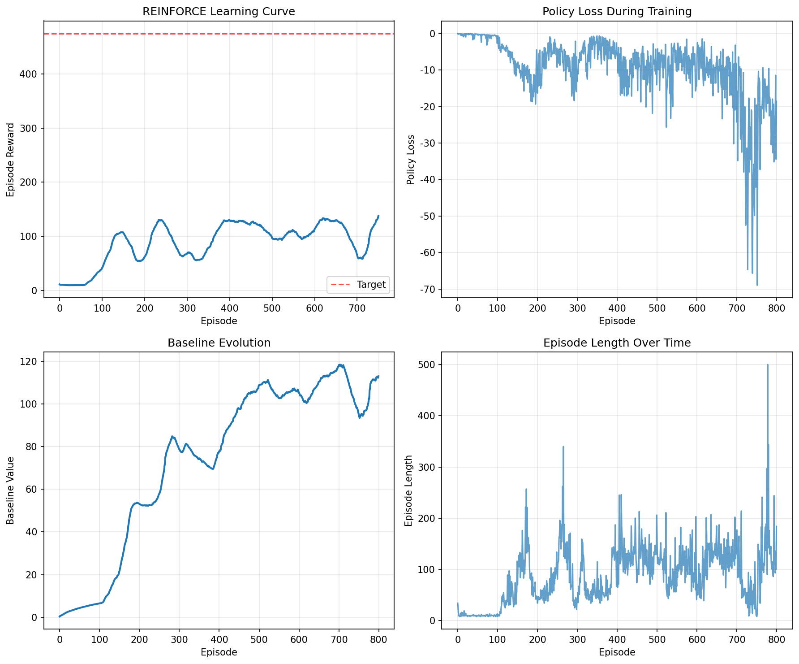

# Chapter 11: Policy Gradients — Policy Gradient Methods and REINFORCE

## Theory Summary

Policy gradient methods directly optimize a parameterized policy \(\pi_\theta(a|s)\) by performing gradient ascent on expected return. The core result, the Policy Gradient Theorem, gives:

\[\nabla_\theta J(\theta) = \mathbb{E}_{\tau \sim \pi_\theta} \left[\sum_{t=0}^{T} \nabla_\theta \log \pi_\theta(a_t|s_t)\, G_t \right],\n\]

where \(G_t\) is the return (discounted cumulative reward) from time t. In practice this expectation is estimated with Monte Carlo rollouts. The fundamental algorithm derived from this is REINFORCE (Monte Carlo policy gradient): roll out trajectories under current policy, compute returns \(G_t\), and update parameters via the sample gradient estimate.

Key concepts and practical considerations:

- Log-prob trick: \(\nabla_\theta \log \pi_\theta(a|s)\) multiplied by a scalar return provides an unbiased estimator of the policy gradient.
- Baselines: Subtracting a baseline \(b(s)\) from returns reduces variance without introducing bias. A common baseline is a state-value function \(V_\phi(s)\) or even a running average of episode returns.
- Advantage: Replacing \(G_t\) with an advantage estimate \(A_t = G_t - b(s_t)\) centers the gradient.
- Variance vs bias trade-offs: Using bootstrapped estimates (e.g., actor-critic) reduces variance at the expense of bias.
- Entropy regularization: Adding an entropy term to the objective encourages exploration and prevents premature convergence to deterministic policies.
- Normalization: Normalizing returns (zero mean, unit variance) stabilizes learning.
- Monte Carlo updates: REINFORCE updates after full episodes — can be slow for long episodes; n-step or on-policy actor-critic methods can alleviate this.

Common failure modes:

- High variance estimators leading to noisy gradients.
- Sensitivity to learning rate and reward scale.
- Poor sample efficiency compared to value-based methods.

## Code Implementation Breakdown

File: `pytorch_rl_tutorial/chapter_11_policy_gradients.py`

- PolicyNetwork(nn.Module):
  - Simple MLP mapping states to action logits. Uses Kaiming initialization on Linear layers.
  - Methods:
    - forward(state): returns logits
    - get_action_probs(state): softmax over logits
    - sample_action(state): constructs a Categorical distribution with logits and samples an action and its log-prob
    - get_log_prob(state, action): returns log probability of a provided action

- REINFORCEAgent:
  - Holds a PolicyNetwork and an Adam optimizer.
  - Episode buffers: states, actions, rewards, log_probs.
  - Baseline: a running average scalar baseline updated with a simple exponential moving average (baseline_lr).
  - select_action(state): samples action, records state/action/log_prob
  - store_reward(reward): append reward
  - compute_returns(): computes discounted returns G_t by iterating the episode rewards backward
  - update_policy():
    - stacks log_probs and constructs returns_tensor
    - normalizes returns (if >1 length)
    - subtracts baseline if enabled
    - computes policy_loss = -(log_probs * returns).mean()
    - backward, gradient clip, optimizer.step()
    - updates scalar baseline with episode return
  - end_episode(): calls update_policy() and clears buffers

- train_reinforce(): Standard loop that collects an episode, then calls end_episode(), maintains recent_rewards deque for monitoring and early stopping.

- Visualization: After training, script saves a 2x2 grid PNG plotting learning curve (smoothed), policy loss, baseline evolution, and episode length.

## Mapping: Theory ↔ Code

- Policy gradient estimator: Implemented directly in REINFORCEAgent.update_policy with log_probs * returns and mean reduction.
- Baseline: Implemented as a scalar running average inside the agent; subtracted from normalized returns as a baseline for variance reduction.
- Normalization: Returns are standardized when episode length > 1 before baseline application; this matches textbook practice.
- Monte Carlo updates: Training updates occur after full episodes (train_reinforce runs until terminated/truncated and then calls end_episode).
- Entropy: Not explicitly implemented in this script; adding an entropy bonus would involve computing distribution.entropy() and adding -beta * entropy to the policy_loss.
- Gradient clipping: Implemented with clip_grad_norm_ to help stabilize training.

