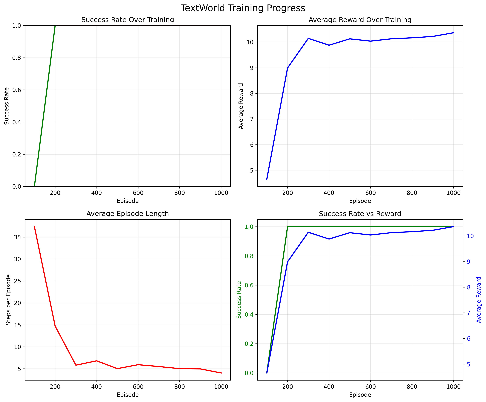

# Chapter 13: The TextWorld Environment — NLP + RL for Interactive Fiction

## Theory Summary (detailed)

Text-based games are POMDPs where observations are natural-language descriptions and the action space is free-text commands. Key challenges:
- Large discrete vocabulary for both observations and commands.
- Partially observable state (inventory may be hidden, long temporal dependencies).
- Extremely sparse rewards for long quests.

Approaches used in the chapter:
- Convert each observation and candidate command into fixed-size vector encodings using embeddings + LSTMs (or pretrained Transformer embeddings).
- Reduce action space by using admissible commands provided by TextWorld (action masking) so the agent evaluates only valid options in a state.
- Use an encode-evaluate architecture: encode observation with several encoders (room description, inventory, objective), encode the candidate command, then pass concatenated features into a small DQN that produces a scalar Q-value for that (state, command) pair.

Why this design:
- We cannot predict Q-values for every possible free-text action in one forward pass feasibly, so evaluating each admissible command separately is simpler and guarantees correctness with an arbitrary command set.
- Embedding + encoder reduces variable-length sequences to fixed-size features that traditional feed-forward heads can use.

NLP building blocks covered:
- Tokenization and static vocabulary (or sentence-transformer embeddings for transformer-based models).
- Encoder: LSTM to pack tokens into a hidden representation.
- Transformer fine-tuning: precomputed sentence embeddings (sentence-transformers) used as stronger encoders.
- LLM usage (ChatGPT): demonstration of zero-shot performance for command generation; shows value of pretrained language models for semantic tasks without RL training.

## Code Implementation Breakdown (mapping to files)

Files & core modules in the chapter's implementation (guide to key classes):

- `pytorch_rl_tutorial/chapter_13_textworld.py` — a standalone simplified TextWorld example (toy env + LSTM policy + REINFORCE agent). The repository version contains a richer pipeline in `lib/`.
- `lib/preproc.py` (described in the chapter): `TextWorldPreproc` wrapper
  - Handles tokenization, optional extra info (inventory, admissible commands), intermediate rewards, and adapts TextWorld API to an RL-friendly interface.
  - `reset()` and `step()` call `_encode(obs, extra)` to return `{'obs': [...], 'admissible_commands': [...]}` and manage last_admissible_commands.

- `lib/model.py` / `lib/preproc.py` (encoders & preprocessors):
  - `Encoder` class: an LSTM wrapper that returns final hidden state: it calls `self.net.flatten_parameters()` and returns `hid_cell[0].squeeze(0)` to be efficient for cuDNN.
  - `Preprocessor` class: creates embedding layer and multiple `Encoder` instances, one per input sequence (description, inventory, objective). Key methods:
    - `_apply_encoder(batch, encoder)`: packs variable-length sequences using `pack_sequence` and runs encoder.
    - `encode_observations`, `encode_sequences`, `encode_commands`: produce fixed-size tensors from lists of variable-length token lists.

- `lib/model.DQNModel`
  - Accepts `obs_tensor` (concatenated encodings) and `cmd_tensor` (command encoding) and returns a scalar Q-value per pair.
  - `q_values(obs_t, commands_t)`: iterates through command encodings for a single state and returns Q-value per command.

- `REINFORCETextAgent` (in the simplified chapter script):
  - `select_action(obs)`: tokenizes observation, builds valid action mask, runs the LSTM policy to produce logits, samples an action via Categorical (when training), or argmax (when evaluating).
  - `train_episode()`: collects a full episode’s transitions, computes returns, stacks log_probs and values, computes policy and value losses (policy_loss uses detached advantages; value_loss MSE), performs backward + gradient clipping and optimizer step.

- Utilities: vocabulary collection (`collect_vocabulary_data`), `TextTokenizer` (builds token->idx dictionary), and plotting utilities for training progress.

## Code Walkthrough (important functions & lines)

1) `TextWorldPreproc._encode()` (preproc wrapper):
- Converts raw string observation and `extra_info` dict into token lists and the list of admissible commands (key `KEY_ADM_COMMANDS`).
- Stores `_last_admissible_commands` so the `step()` method can convert an action index back to the actual command text during execution.

Why: This bridges the TextWorld API and the RL agent expectation (fixed action indices referencing admissible commands).

2) `Preprocessor._apply_encoder()` and `encode_sequences()`:
- Uses `self.emb(torch.tensor(sample))` over a list of sequences converted to torch tensors.
- Packs the sequences using `rnn_utils.pack_sequence(batch_seq, enforce_sorted=False)`; this avoids manual sorting.
- Calls encoder which returns final LSTM hidden state for each sequence.

Why: Efficient batching of variable-length sequences; `flatten_parameters()` in the LSTM helps cuDNN performance.

3) `DQNModel.q_values(obs_t, commands_t)`:
- Iterates over each encoded command and calls `self(obs_t, cmd_t.unsqueeze(0))` to compute q-value for each (obs,cmd).
- Returns a list of Q-values to be used for argmax selection.

Why: This design lets you keep a compact model while handling a variable number of admissible commands per state.

4) `REINFORCETextAgent.train_episode()` in `chapter_13_textworld.py` (simplified REINFORCE pipeline):
- Selects actions with `action_dist = Categorical(action_probs)` and stores log_prob tensors.
- After episode ends, computes discounted returns via `_calculate_returns()`.
- Stacks `log_probs`, `values` (value head outputs), compute `advantages = returns - values`.
- Policy loss (detach advantages): `policy_loss = -(log_probs * advantages.detach()).mean()`
- Value loss: `MSE(values, returns)`
- Update: zero_grad(), total_loss.backward(), clip_grad_norm_(...), optimizer.step()

Important note: The simplified REINFORCETextAgent also keeps the value head, so although called REINFORCE it follows an actor-critic-style loss mix (policy + 0.5 * value MSE) typical for on-policy text agents.

5) Transformer / sentence-transformers usage (chapter text):
- Swap the LSTM Preprocessor for `sentence-transformers` to compute sentence embeddings with `model.encode(str_or_list)` and use these vectors as fixed-size encodings.
- Pros: much stronger embeddings, faster convergence in terms of episodes on many games.
- Cons: higher compute cost per step (slower FPS), risk of overfitting due to large embedding capacity.

6) ChatGPT experiments (chatgpt_auto.py and chatgpt_interactive.py)
- Uses OpenAI API (via langchain) to generate next commands given the current observation and history.
- Maintains conversation context so ChatGPT can use prior objective and earlier room descriptions.
- Finds impressive zero-shot performance on many small games; cost measured (chapter: ~450k tokens, $0.20 at time of writing).

