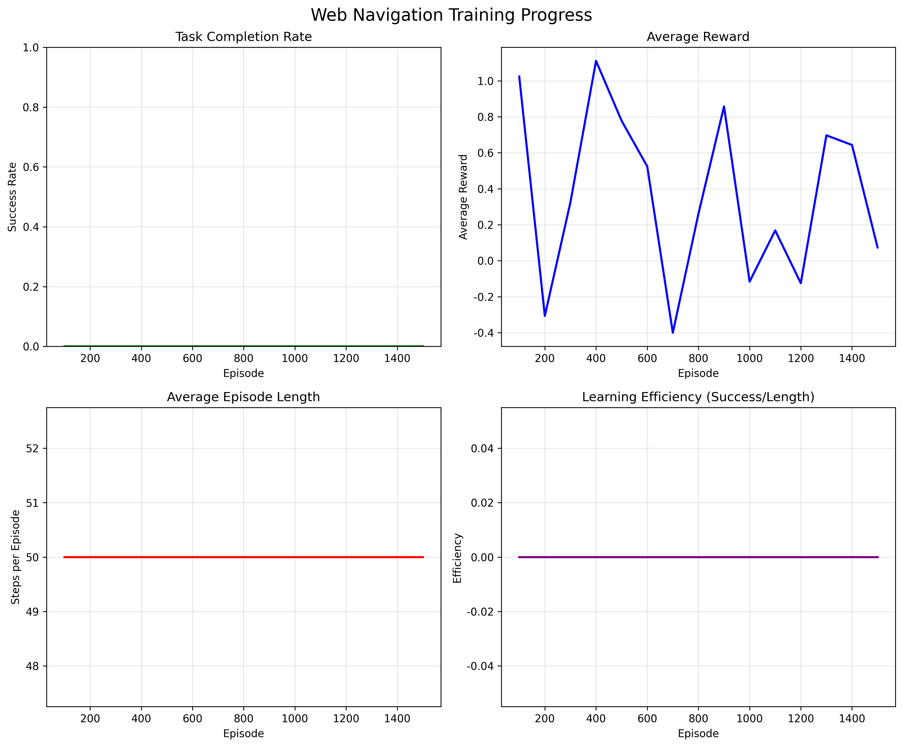

# Chapter 14: Web Navigation — MiniWoB, DOMs, and Multimodal Policies

## Theory Summary (detailed)

Web navigation tasks combine visual, structural (DOM), and textual signals. They expose a much richer action and observation space than Atari-like tasks: keyboard state, mouse coordinates, DOM element identifiers and attributes, and screen pixels.

Key design dimensions:
- Action space design: raw mouse + keyboard (continuous/large) vs discretized grid/cell clicks vs DOM-element-level actions. The chapter shows that a grid (binning) action space is a useful trade-off for many tasks.
- Observation modalities: pixel screenshot, text instruction (utterance), DOM element list (structured features). Combining these (multimodal) improves performance on tasks requiring textual grounding.
- Reward shaping & demonstrations: many web tasks are sparse — incorporating human demonstrations or well-designed shaping drastically improves learning.

Benchmarks and tooling:
- MiniWoB (and MiniWoB++): a set of 80+ browser tasks. Farama maintains a modern MiniWoB++ with Selenium backend. Tasks vary by complexity from single clicks to multi-step form submissions.

Core modeling decisions discussed:
- Grid action wrapper: discretize the clickable area into bins (e.g., 160x210 with bin size 10 -> 256 discrete actions). Action index -> (bin_x, bin_y) -> actual click coords.
- DOM-based selection: use the DOM element list (each element has attributes like position, size, text, clickable flag) to select elements by index (action = CLICK_ELEMENT with ref id). This avoids pixel-level ambiguity.
- Multimodal policy: CNN (visual) + RNN/embedding (text/DOM) -> concat features -> actor & critic heads.

## Code Implementation Breakdown (mapping to files)

File: `pytorch_rl_tutorial/chapter_14_web_navigation.py`

- `MiniWoBClickWrapper` (lib/wob.py in the book)
  - Constructor sets observation_space to CHW image or (image, text) tuple and action_space to Discrete(count) where count = x_bins * y_bins.
  - `create()` classmethod: registers envs and constructs wrapper with a custom ActionSpaceConfig that uses `ActionTypes.CLICK_COORDS` and maps discrete action indices to grid coordinates.
  - `_observation()` helper: converts raw obs dict to (screenshot_CHW, text) or image only.
  - `step(action)`: maps discrete `action` -> (b_x, b_y) using `action_to_bins`, wraps into the env action dict {action_type:0, coords: np.array((b_x,b_y))} and executes `self.env.step(new_act)`.

- `action_to_bins` helper
  - Converts `action` index into (b_x, b_y) using integer division and mod arithmetic. This is straightforward but crucial for reproducibility of mapping.

- `Model` / `ModelMultimodal` (policy networks)
  - Convolutional backbone converts screenshot to feature vector (two conv layers + flatten).
  - When text is included, an Embedding + LSTM processes tokens into a fixed-size vector; concatenated with conv output and fed to policy and value heads.
  - Forward pass normalizes image (x/255.0) before convolution.

- Training scripts (wob_click_train.py, wob_click_mm_train.py)
  - Typical A3C/A2C training harness: use AsyncVectorEnv with multiple Chrome instances, collect trajectories, compute returns/advantages, and run updates.
  - Use the MultimodalPreprocessor (Tokenization + packing) to convert batches of (image, text) into tensors suitable for model.

## Code Walkthrough (important functions)

1) `MiniWoBClickWrapper.create()`
- Registers miniwob envs (gym.register_envs(miniwob)) then creates environment via `gym.make(env_name, action_space_config=act_cfg)`.
- Wraps env with `MiniWoBClickWrapper(env, keep_text=..., keep_obs=...)` to prepare RL-friendly interfacing.

2) `_observation()` & `reset()`
- Converts `obs['screenshot']` from HWC to CHW and optionally returns the instruction `obs['utterance']` as text for the multimodal case.
- When `keep_obs=True` it stores the full raw observation into `info['full_obs']` to enable later inspection or human replay.

3) `step(action)`
- Uses `action_to_bins(action, bin_size)` to compute grid coordinates, constructs the new action dict and calls the underlying env step.
- Returns `(processed_observation, reward, done, info)` in gym-like format.

4) `Model.forward(x)` and multimodal concatenation
- `conv_out = self.conv(x_img / 255.0)` then `rnn_out` from token-packed sequence.
- `feats = concat(conv_out, rnn_hidden)` and return `policy_logits` and `value` heads.

