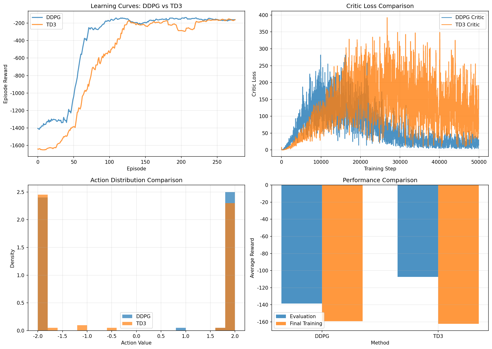

# Chapter 15: Continuous Action Spaces — Summary

## Theory Summary

Continuous-action reinforcement learning addresses problems where the agent must choose from a continuous set of actions (for example, torques for robot joints or steering angles for vehicles). Discrete-action value methods (DQN) are not directly applicable because they require a max_a operation. The main approaches are policy-based and actor-critic (hybrid) methods that produce continuous actions directly.

Key algorithm families:

- Deterministic Policy Gradients (DPG): learn a deterministic mapping \(\mu_\theta(s)\) and use the critic \(Q_\phi(s,a)\) to estimate gradients of the expected return w.r.t. policy parameters via the deterministic policy gradient theorem.

- Deep Deterministic Policy Gradient (DDPG): a deep-learning instantiation of DPG that borrows ideas from DQN — replay buffer, target networks — and uses an actor (deterministic policy) and critic (Q-network) trained off-policy.

- Twin Delayed DDPG (TD3): improves DDPG by (1) employing two critics and taking the minimum to reduce overestimation bias, (2) delaying actor updates relative to critic updates, and (3) smoothing target actions by adding clipped noise to the target policy.

Exploration for continuous policies commonly uses additive noise:

- Ornstein–Uhlenbeck (OU) process: temporally correlated noise often used for physical control tasks.
- Simple Gaussian noise: independent per-step noise; often works well in simulated domains.

Important equations and highlights:

- Deterministic policy gradient (informal):

  $$\nabla_\theta J(\theta) = \mathbb{E}_{s\sim\rho^\mu} \left[ \nabla_\theta \mu_\theta(s) \nabla_a Q^\mu(s,a) \big|_{a=\mu_\theta(s)} \right]$$

- DDPG critic target (with target networks):

  $$y = r + \gamma (1-\mathbf{1}_{done}) Q_{\phi'}(s', \mu_{\theta'}(s'))$$

- TD3 target with target policy smoothing and twin critics:

  $$\tilde{a}' = \text{clip}(\mu_{\theta'}(s') + \epsilon, -a_{max}, a_{max}), \qquad \epsilon\sim\text{clip}(\mathcal{N}(0,\sigma), -c, c)$$

  $$y = r + \gamma (1-\mathbf{1}_{done}) \min\{Q_{\phi'_1}(s',\tilde{a}'), Q_{\phi'_2}(s',\tilde{a}')\}$$

Practical hyperparameters (typical ranges):

- Replay buffer size: 100k–1M
- Batch size: 64–256
- Actor / critic learning rates: 1e-4 – 1e-3
- Discount (\(\gamma\)): 0.98–0.999
- Soft update factor (\(\tau\)): 1e-3 – 5e-3
- OU / Gaussian noise scale: 0.1–0.3
- TD3-specific: policy_noise \(\sigma\) ≈ 0.2, noise_clip ≈ 0.5, policy_delay = 2

Common failure modes and mitigations:

- Overestimation by critic: use twin critics and take minimum (TD3), or distributional methods (D4PG) to model value uncertainty.
- Poor exploration: tune noise process, try parameter-space noise or entropy-regularized stochastic policies (SAC).
- Instability from function approximation: normalize inputs/returns, use smaller learning rates, gradient clipping, and target networks.

## Code Implementation Breakdown (file: `pytorch_rl_tutorial/chapter_15_continuous_actions.py`)

This chapter file implements DDPG and TD3 agents and trains them on a continuous control environment (e.g., `Pendulum-v1`). The implementation maps directly to the theory above.

Key classes and functions (mapping to code):

- OrnsteinUhlenbeckNoise, GaussianNoise
  - Purpose: exploration noise generators. `OrnsteinUhlenbeckNoise.sample()` returns temporally correlated noise; `GaussianNoise.sample()` returns i.i.d. Gaussian noise.
  - Use: added to actor output when `add_noise=True` in `select_action()`.

- Actor(nn.Module)
  - A 3-layer MLP with final Tanh scaled by `max_action`. Weight init uses Kaiming normal.
  - forward(state) returns actions in the environment action range.

- Critic(nn.Module)
  - Processes state with `state_net` and concatenates action, then outputs a single scalar Q-value.

- ReplayBuffer
  - Simple deque-based buffer with `push()` and `sample(batch_size)` returning batched tensors.

- DDPGAgent
  - Holds `actor`, `actor_target`, `critic`, `critic_target`, optimizers, `replay_buffer`, and noise process.
  - select_action(state, add_noise=True): runs actor forward and optionally adds noise (clipped to action range).
  - store_transition(...): pushes transitions to buffer.
  - train(batch_size): samples a batch and performs critic and actor updates:
    - Critic: MSE loss between current Q and target Q computed with `actor_target` and `critic_target`.
    - Actor: maximize Q by minimizing `-critic(state, actor(state)).mean()`.
    - Soft updates are applied after parameter updates.

- TD3Agent
  - Similar structure but with two critics (`critic1`, `critic2`) and twin target critics.
  - train(batch_size):
    - Adds clipped Gaussian noise to the actor_target output for target smoothing.
    - Computes target Q as the minimum of the two critic-targets.
    - Updates both critics with MSE losses.
    - Delays actor update using a `total_it` counter and `policy_delay` frequency.
    - Soft-updates the target networks when actor is updated.

- train_continuous_agent(agent, env, ...)
  - Standard training loop: for each episode, select action, step environment, store transition, call `agent.train()` once per step (after buffer warm-up). Logs and returns episode statistics.

- Utilities: evaluation, plotting (learning curves, losses, action distributions).

Important implementation notes from the code:

- Device management: models moved to `cuda` if available.
- The replay buffer stores `torch.FloatTensor` conversion on sampling; `done` flags are returned as `torch.BoolTensor` and later used in target computation by converting to float and multiplying `(1 - done)`.
- Soft update uses:
  - target_param = tau * param + (1 - tau) * target_param
  which is standard polyak averaging.
- TD3 policy noise for target smoothing is sampled per-sample via `torch.randn_like(action) * policy_noise` and clipped to `[-noise_clip, noise_clip]`.

## Connection Between Theory and Code

- Deterministic policy gradients: the actor update minimizes the negative critic estimate at the actor output, implementating the gradient-of-Q times gradient-of-policy chain rule used in DPG and DDPG.

- Target networks + replay buffer: implemented verbatim to stabilize training and break correlations in data, matching DDPG design.

- TD3 improvements: twin critics, target policy smoothing, and delayed actor updates are clearly reflected in `TD3Agent.train()`.

- Practical choices in the code mirror typical engineering: small batch sizes (64), soft update tau=0.005, policy_noise and noise_clip settings for TD3, and the option to pick OU vs Gaussian exploration noise.

