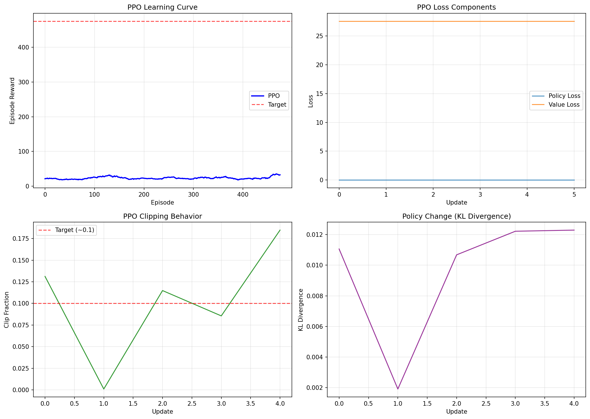

# Chapter 16: Trust Region Methods (PPO / TRPO) — Summary

## Theory Summary

Trust-region methods address instability in policy-gradient updates by constraining how far the new policy can move away from the old policy in a single update. The canonical TRPO algorithm enforces a KL-divergence constraint and optimizes a surrogate objective under that constraint, typically using conjugate gradient to compute the natural policy gradient and line search to enforce improvement. Proximal Policy Optimization (PPO) is a simpler, first-order variant that approximates this trust-region constraint using a clipped surrogate objective or a KL penalty.

Key math and concepts:

- Surrogate objective (importance-sampled expected advantage):

  $$L^{\mathrm{PG}}(\theta) = \mathbb{E}_t\left[\frac{\pi_\theta(a_t|s_t)}{\pi_{\theta_{old}}(a_t|s_t)} \hat{A}_t\right]$$

- Clipped surrogate used in PPO:

  $$L^{\mathrm{CLIP}}(\theta) = \mathbb{E}_t\left[\min\left(r_t(\theta) \hat{A}_t, \text{clip}(r_t(\theta), 1-\epsilon, 1+\epsilon)\hat{A}_t\right)\right]$$

  where \(r_t(\theta) = \frac{\pi_\theta(a_t|s_t)}{\pi_{\theta_{old}}(a_t|s_t)}\).

- Generalized Advantage Estimation (GAE): an exponentially-weighted average of n-step TD-errors to trade off bias and variance in advantage estimates:

  $$A_t^{\mathrm{GAE}(\gamma,\lambda)} = \sum_{l=0}^{\infty} (\gamma\lambda)^l \delta_{t+l}$$

  where \(\delta_t = r_t + \gamma V(s_{t+1}) - V(s_t)\).

- PPO practicalities: multiple epochs over the same collected batch, normalized advantages, entropy bonus for exploration, value-function loss coefficient.

## Code Implementation Breakdown (file: `pytorch_rl_tutorial/chapter_16_trust_regions.py`)

This chapter's code focuses on PPO with a reusable Actor-Critic network capable of handling both discrete and continuous action spaces.

Key components:

- `GAECalculator`
  - Implements backward pass to compute advantages and returns using the formula above. The `compute_gae()` function performs the backward recursion, handling `dones` correctly and supporting bootstrapping with `next_value`.

- `PPOActorCritic(nn.Module)`
  - Shared torso with two heads: actor (either logits for discrete actions or mean+log_std for continuous) and critic (`value_head`).
  - `get_action_and_value()` returns sampled action, log-prob, entropy and value. For continuous actions it models a Normal distribution using `action_log_std` as a learnable parameter.

- `PPOAgent`
  - Holds the network, optimizer, GAE calculator, buffering of rollouts, and PPO update logic:
    - `select_action(state)` runs the network to get action/logprob/value for rollout collection.
    - `store_transition()` appends rollout data into `rollout_buffer`.
    - `compute_advantages_and_returns()` calls GAE calculator.
    - `update(next_value)` does the main PPO update:
      - Converts rollout to tensors, normalizes advantages.
      - For `ppo_epochs` times, iterates over minibatches, computing new log probs/entropies/values.
      - Computes ratio = exp(new_log_prob - old_log_prob) and clipped surrogate objective.
      - Computes value loss (MSE) and entropy loss; sums into `total_loss` and applies gradient descent with gradient clipping.
      - Tracks statistics: policy loss, value loss, entropy, clip fraction, and KL divergence surrogate (for monitoring).

- Training harness `train_ppo(agent, env, ...)` collects rollouts until `update_frequency`, then computes `next_value` for bootstrapping and calls `agent.update()`. It logs per-update stats and per-episode rewards.

Implementation notes and engineering details:

- Initialization: orthogonal initialization for linear layers with a small gain for the value head to stabilize value estimates.
- Advantage normalization: advantages are normalized to zero mean and unit variance before PPO updates.
- Clipping and statistics: `clip_fraction` is computed to monitor how often ratios are clipped; a target clip fraction around 0.1 is often used as a sanity check.
- Continuous actions: `action_log_std` is a parameter vector giving per-dimension log standard deviations; `get_action_and_value()` constructs a `Normal` distribution and sums log-probs / entropies across action dimensions.
- Buffer clearing: after update, rollout buffers are cleared.

## Connection Between Theory and Code

- The `PPOAgent.update()` directly implements the clipped surrogate objective and the value/entropy regularization terms. The ratio `exp(new_log_prob - old_log_prob)` is the importance-sampling weight \(r_t(\theta)\).

- GAE is used to compute the advantages that are passed to the surrogate objective, reducing variance while retaining low bias when \(\lambda\) is set close to 1.

- PPO's multiple-epoch minibatch updates correspond to reusing collected data effectively, and the clipping prevents excessively large policy updates that would violate the trust-region intuition.

