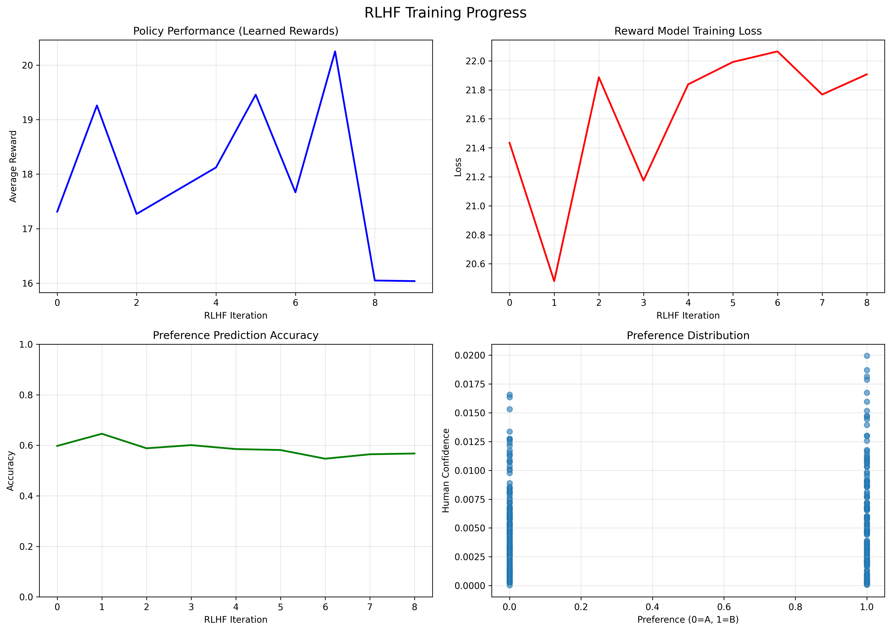

# Chapter 19: Reinforcement Learning with Human Feedback

## Theory Summary

### Introduction to RLHF

Reinforcement Learning with Human Feedback (RLHF) addresses a fundamental challenge in reinforcement learning: situations where the desired behavior is difficult to define through an explicit reward function. This method, initially developed for specific RL problems, has become enormously successful in training Large Language Models (LLMs) and forms the core of modern AI training pipelines.

The core problem RLHF solves is that in many real-world scenarios, formulating an appropriate reward function is non-trivial. Traditional RL environments provide predefined rewards (scores in games, distance traveled in robotics), but real-life applications often involve multiple competing objectives that need careful balancing.

### Motivation and Problem Context

#### Challenges with Traditional Reward Functions

In complex environments, single-objective optimization can lead to undesirable behaviors:

- **Chatbot Example**: A system might provide correct information but in a rude manner, or be polite but incorrect. Optimizing only for correctness ignores important qualitative aspects.
- **Transportation Example**: Companies don't just maximize profits; they must consider regulations, safety, and ethical constraints alongside efficiency.

#### The SeaQuest Case Study

The SeaQuest Atari game exemplifies these challenges with multiple reward sources:
- Shooting enemy fish and submarines
- Saving divers and bringing them to surface
- Avoiding enemy fire
- Managing oxygen levels

Traditional RL methods struggle with discovering complex behaviors like oxygen management because:
- The reward for saving divers only occurs after collecting six divers and reaching the surface
- Oxygen replenishment requires understanding causal relationships that aren't immediately apparent
- Trial-and-error exploration with ε-greedy methods takes impractically long to discover these behaviors

### Theoretical Foundations

#### The RLHF Pipeline

The method, introduced by Christiano et al. in "Deep reinforcement learning from human preferences," replaces the environment reward with a learned **reward predictor** network r̂(o,a) that takes observations and actions as input and outputs reward values.

#### Preference Learning Framework

Instead of direct reward labeling, humans provide **preferences** between trajectory segments:
- Humans are shown two short video clips (σ₁, σ₂) of agent behavior
- They indicate which is better: "first," "second," "both good," or "cannot judge"
- These preferences are used to train the reward model

#### Mathematical Formulation

The probability that humans prefer segment σ₁ over σ₂ is modeled using the Bradley-Terry model:

p̂[σ₁ ≻ σ₂] = exp(∑r̂(oₜ,aₜ)) / [exp(∑r̂(oₜ,aₜ)) + exp(∑r̂(o'ₜ,a'ₜ))]

The reward model is trained using cross-entropy loss:

L = -[μ₁ log p̂(σ₁ ≻ σ₂) + μ₂ log p̂(σ₂ ≻ σ₁)]

Where μ values are assigned based on human judgments:
- Prefer first: μ₁ = 1, μ₂ = 0
- Prefer second: μ₁ = 0, μ₂ = 1
- Both good: μ₁ = 0.5, μ₂ = 0.5

#### Advantages of Preference Learning

1. **Sample Efficiency**: Requires far fewer human labels than per-action reward labeling
2. **Negative Feedback**: Provides information about undesirable behaviors, unlike demonstration-based methods that only show positive examples
3. **Accessibility**: Humans can recognize good behavior even if they cannot demonstrate it (e.g., complex robot control)

### Parallel Training Process

The original RLHF implementation runs three processes concurrently:

1. **RL Training**: Uses the current reward model for policy optimization, storing random trajectory segments
2. **Human Labeling**: Samples segment pairs and collects human preferences
3. **Reward Model Training**: Periodically updates the reward model using collected preferences

### RLHF in Large Language Models

The RLHF pipeline for LLMs consists of three stages:

1. **Pretraining**: Unsupervised training on massive text corpora (trillions of tokens)
2. **Supervised Fine-Tuning**: Training on curated example dialogues (10K-100K examples)
3. **RLHF Alignment**: Using preference learning to align the model with human values (≈1M preference pairs)

The third stage is crucial for ensuring models generate socially acceptable, helpful responses while maintaining correctness.

### Experimental Methodology

#### Implementation Adaptations

The practical implementation makes several adaptations from the original paper:
- Focus on SeaQuest environment instead of multiple environments
- Sequential rather than parallel training phases
- Simplified reward model training without ensembles or L2 regularization
- Smaller scale (hundreds rather than thousands of labels)
- Explicit inclusion of actions in the reward model

#### Training Pipeline

1. **Initial A2C Training**: Baseline training with environment rewards
2. **Segment Collection**: Storing random trajectory segments for labeling
3. **Human Labeling**: Web-based interface for collecting preferences
4. **Reward Model Training**: Learning reward predictions from preferences
5. **Policy Fine-tuning**: RL training using learned rewards instead of environment rewards

## Code Implementation Breakdown

### Core Data Structures

```python
@dataclass
class Trajectory:
    """Represents a complete trajectory/episode"""
    states: List[np.ndarray]
    actions: List[int] 
    rewards: List[float]
    total_reward: float
    length: int

@dataclass
class Preference:
    """Represents human preference between two trajectories"""
    traj_a: Trajectory
    traj_b: Trajectory
    preference: int  # 0 for traj_a, 1 for traj_b
    confidence: float  # Human confidence
```

These data structures encapsulate the fundamental units of RLHF:
- `Trajectory` stores complete episodes for analysis and comparison
- `Preference` captures human judgments between trajectory pairs

### Custom Environment with Interpretable Rewards

```python
class CustomCartPoleEnv:
    def __init__(self, reward_type="standard"):
        self.reward_type = reward_type
        # Environment parameters...
    
    def _calculate_reward(self):
        if self.reward_type == "standard":
            return 1.0  # Standard CartPole reward
        elif self.reward_type == "balanced":
            # Multi-objective reward balancing position, angle, stability
            angle_reward = 1.0 - abs(theta) / self.theta_threshold_radians
            position_reward = 1.0 - abs(x) / self.x_threshold
            stability_reward = 1.0 - (abs(x_dot) + abs(theta_dot)) / 10.0
            return (angle_reward + position_reward + stability_reward) / 3.0
```

The custom environment provides different reward formulations to simulate the challenge of reward engineering that RLHF addresses.

### Neural Network Architectures

#### Policy Network
```python
class PolicyNetwork(nn.Module):
    def __init__(self, state_dim=4, action_dim=2, hidden_dim=64):
        super().__init__()
        self.network = nn.Sequential(
            nn.Linear(state_dim, hidden_dim), nn.ReLU(),
            nn.Linear(hidden_dim, hidden_dim), nn.ReLU(), 
            nn.Linear(hidden_dim, action_dim), nn.Softmax(dim=-1)
        )
```

Standard policy network with softmax output for action probabilities.

#### Reward Model
```python
class RewardModel(nn.Module):
    def __init__(self, state_dim=4, hidden_dim=128):
        super().__init__()
        self.network = nn.Sequential(
            nn.Linear(state_dim, hidden_dim), nn.ReLU(),
            nn.Linear(hidden_dim, hidden_dim), nn.ReLU(),
            nn.Linear(hidden_dim, 1)  # Single reward output
        )
```

The reward model learns to predict scalar rewards from states, trained on human preferences.

### Human Oracle Simulation

```python
class HumanOracle:
    def compare_trajectories(self, traj_a: Trajectory, traj_b: Trajectory) -> Preference:
        utility_a = self._calculate_utility(traj_a)
        utility_b = self._calculate_utility(traj_b)
        
        # Add noise and bias to simulate human imperfection
        noisy_utility_a = utility_a + np.random.normal(0, self.noise_level)
        noisy_utility_b = utility_b + np.random.normal(0, self.noise_level)
        noisy_utility_a += self.preference_bias
        
        # Determine preference based on noisy utilities
        if noisy_utility_a > noisy_utility_b:
            preference = 0
        else:
            preference = 1
```

The human oracle simulates real human labeling with:
- Multi-criteria utility calculation
- Noise to represent human uncertainty
- Bias to model systematic preferences

### Core RLHF Trainer

#### Trajectory Collection
```python
def collect_trajectories(self, num_trajectories=100):
    trajectories = []
    for _ in range(num_trajectories):
        trajectory = self._rollout_trajectory()
        trajectories.append(trajectory)
        self.trajectory_buffer.append(trajectory)
    return trajectories
```

Collects trajectories using current policy for preference labeling.

#### Preference Collection
```python
def collect_preferences(self, num_preferences=50):
    new_preferences = []
    trajectories = list(self.trajectory_buffer)
    for _ in range(num_preferences):
        traj_a, traj_b = random.sample(trajectories, 2)
        preference = self.human_oracle.compare_trajectories(traj_a, traj_b)
        new_preferences.append(preference)
    self.preference_data.extend(new_preferences)
    return new_preferences
```

Samples random trajectory pairs and gets simulated human preferences.

#### Reward Model Training
```python
def train_reward_model(self, num_epochs=100, batch_size=32):
    for preference in batch_preferences:
        reward_a = self.reward_model.predict_trajectory_reward(preference.traj_a)
        reward_b = self.reward_model.predict_trajectory_reward(preference.traj_b)
        
        # Bradley-Terry model implementation
        rewards = torch.stack([reward_a, reward_b])
        probs = F.softmax(rewards, dim=0)
        loss = F.cross_entropy(probs.unsqueeze(0), labels.unsqueeze(0))
```

Implements the Bradley-Terry preference model using cross-entropy loss.

#### Policy Training with Learned Rewards
```python
def train_policy_with_learned_rewards(self, num_epochs=100):
    # Use learned rewards instead of environment rewards
    learned_rewards = self.reward_model(traj_states).squeeze().detach().numpy()
    
    # PPO objective with clipped policy updates
    ratio = torch.exp(new_log_probs - old_log_probs_tensor)
    clipped_ratio = torch.clamp(ratio, 0.8, 1.2)
    policy_loss = -torch.min(ratio * advantages, clipped_ratio * advantages).mean()
```

Uses PPO to train policy with rewards from the learned reward model.

### Experimental Pipeline

```python
def run_rlhf_experiment():
    # 1. Create environment and human oracle
    env = CustomCartPoleEnv(reward_type="balanced")
    human_oracle = HumanOracle(env, noise_level=0.1)
    
    # 2. Initialize RLHF trainer
    trainer = RLHFTrainer(env, human_oracle)
    
    # 3. Iterative RLHF process
    for iteration in range(num_rlhf_iterations):
        # Collect preferences
        trainer.collect_preferences(num_preferences=30)
        # Train reward model
        trainer.train_reward_model(num_epochs=50)
        # Train policy with learned rewards
        trainer.train_policy_with_learned_rewards(num_epochs=50)
        # Evaluate and collect new trajectories
        trainer.collect_trajectories(num_trajectories=20)
```

The complete RLHF loop showing the iterative nature of preference collection and policy improvement.

## Connection Between Theory and Code

### Bridging Preference Learning Theory and Implementation

The mathematical formulation of preference learning directly maps to the code implementation:

**Theory**: p̂[σ₁ ≻ σ₂] = exp(∑r̂(oₜ,aₜ)) / [exp(∑r̂(oₜ,aₜ)) + exp(∑r̂(o'ₜ,a'ₜ))]

**Code**:
```python
reward_a = self.reward_model.predict_trajectory_reward(preference.traj_a)
reward_b = self.reward_model.predict_trajectory_reward(preference.traj_b)
rewards = torch.stack([reward_a, reward_b])
probs = F.softmax(rewards, dim=0)
```

The code implements the Bradley-Terry model by summing rewards over trajectories and applying softmax to get preference probabilities.

### Reward Model Architecture Choices

The theoretical paper uses convolutional networks for image-based environments, while the implementation uses fully-connected networks for CartPole. This adaptation maintains the core concept while adjusting for problem complexity.

### Human Feedback Simulation

**Theory**: Humans provide noisy, biased preferences based on multiple criteria.

**Code**: The `HumanOracle` simulates this with:
- Multi-component utility function (length, stability, smoothness)
- Gaussian noise for uncertainty
- Configurable bias parameters

### RL Integration

**Theory**: Use the learned reward model in standard RL algorithms.

**Code**: The implementation shows how to:
- Replace environment rewards with learned rewards in the training loop
- Maintain reward normalization for training stability
- Handle the transition from true rewards to learned rewards

### Experimental Validation

The code provides comprehensive evaluation methods that mirror the theoretical goals:

```python
def analyze_reward_model(trainer, env):
    # Test reward model on interpretable states
    test_states = [
        [0.0, 0.0, 0.0, 0.0],      # Centered, upright (should be high reward)
        [2.0, 0.0, 0.0, 0.0],      # Far off-center (should be low reward)
    ]
    
    # Calculate preference prediction accuracy
    agreement_rate = correct_predictions / total_predictions
```
