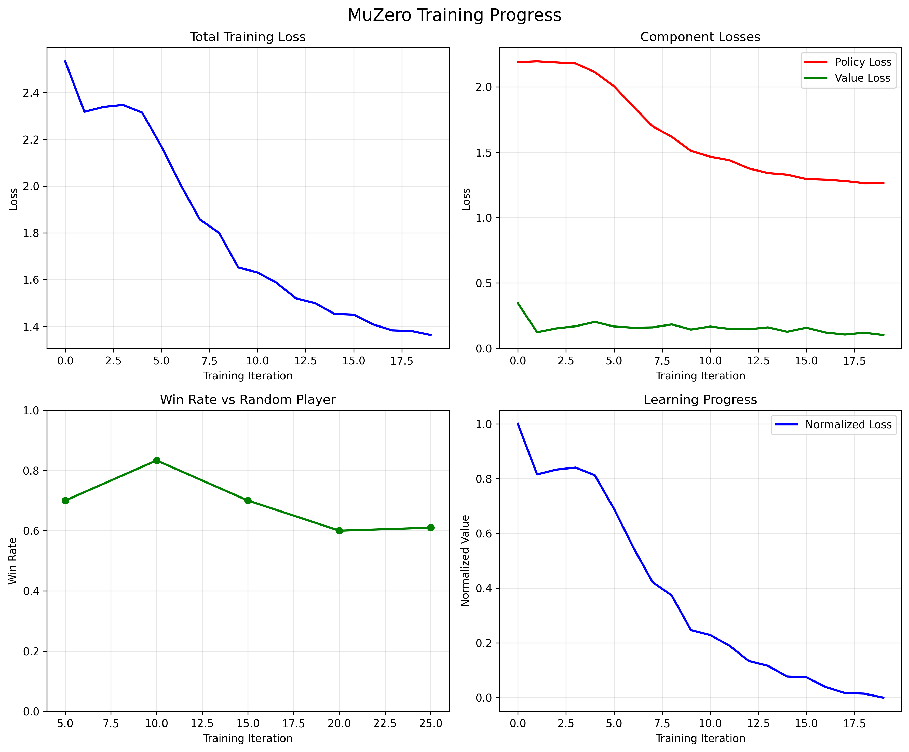

# Chapter 20: AlphaGo Zero and MuZero

## Theory Summary

### Introduction to Model-Based Methods

AlphaGo Zero and MuZero represent a paradigm shift in reinforcement learning by demonstrating that agents can achieve superhuman performance through self-play without any prior human knowledge. These methods belong to the **model-based RL** category, where agents learn an internal model of their environment and use it for planning and decision-making.

#### Model-Based vs Model-Free RL

**Model-Free Methods** (covered in previous chapters):
- Directly learn policies or value functions from environment interactions
- Treat environment as a black box
- Require extensive sampling from the real environment
- Examples: DQN, PPO, A2C

**Model-Based Methods**:
- Learn an internal model of environment dynamics
- Can plan ahead using the learned model
- More sample-efficient but require accurate models
- AlphaGo Zero/MuZero extend this to competitive games

### The AlphaGo Zero Method

#### Core Components

AlphaGo Zero consists of three interconnected components:

1. **Monte Carlo Tree Search (MCTS)**: The planning algorithm that explores possible future game states
2. **Self-Play**: The training mechanism where the agent plays against itself
3. **Neural Network**: Learns to evaluate positions and suggest moves

#### Monte Carlo Tree Search (MCTS)

MCTS is the cornerstone of AlphaGo Zero, providing a sophisticated planning mechanism that balances exploration and exploitation. The algorithm maintains statistics for each game state and action:

- **N(s,a)**: Visit count - how many times action a was taken from state s
- **Q(s,a)**: Action value - average outcome of taking action a from state s  
- **P(s,a)**: Prior probability - neural network's estimate of move quality
- **U(s,a)**: Exploration bonus - encourages trying less-visited actions

The UCB (Upper Confidence Bound) formula used for action selection:

```
U(s,a) = Q(s,a) + c_puct * P(s,a) * √(∑_b N(s,b)) / (1 + N(s,a))
```

Where `c_puct` controls the exploration-exploitation tradeoff.

#### Self-Play Training Cycle

The training process follows an elegant iterative pattern:

1. **Current Best Model** plays games against itself using MCTS
2. **Training Data** is collected from these self-play games
3. **Apprentice Network** is trained on the collected data
4. **Evaluation** determines if the apprentice outperforms the current best
5. **Replacement** occurs when the apprentice demonstrates superiority

This creates a virtuous cycle where each generation of the network learns from the previous best version.

#### Neural Network Architecture

The neural network in AlphaGo Zero uses a dual-head architecture:

- **Policy Head**: Outputs probability distribution over possible moves
- **Value Head**: Estimates the expected game outcome from current position

The network is trained using a combined loss function:
```
L = (z - v)² - πᵀ log p + λ||θ||²
```
Where:
- `(z - v)²` is the value loss (MSE between predicted and actual outcome)
- `-πᵀ log p` is the policy loss (cross-entropy between MCTS and network policies)
- `λ||θ||²` is L2 regularization

### MuZero: Generalizing Beyond Known Rules

MuZero extends AlphaGo Zero by removing the requirement for explicit game rules, making it applicable to a wider range of environments including Atari games.

#### Three-Network Architecture

MuZero introduces three specialized neural networks:

1. **Representation Network (hθ)**: `o → s`
   - Maps raw observations to hidden states
   - Encodes relevant game information in a compact form

2. **Dynamics Network (gθ)**: `(s, a) → (s', r)`
   - Predicts next hidden state and immediate reward
   - Models environment transitions in latent space

3. **Prediction Network (fθ)**: `s → (p, v)`
   - Outputs policy and value estimates
   - Same as AlphaGo Zero's dual-head network

#### MuZero MCTS Process

The search process in MuZero operates entirely in the learned hidden state space:

1. Encode current observation to hidden state: `s₀ = hθ(o)`
2. Use prediction network: `(p₀, v₀) = fθ(s₀)`
3. Select actions using UCB in hidden space
4. Use dynamics network to simulate: `(r₁, s₁) = gθ(s₀, a)`
5. Repeat steps 2-4 for multiple simulations
6. Backup values through the search path

#### Training with Unrolled Dynamics

MuZero's training involves unrolling the dynamics network for multiple steps:

- **Policy Targets**: MCTS visit counts from self-play
- **Value Targets**: Discounted sum of future rewards
- **Reward Targets**: Actual immediate rewards from environment

The loss function incorporates predictions at multiple time horizons:
```
L = Σₖ₌₀ᴷ [ (zₖ - vₖ)² + πₖᵀ log pₖ + (rₖ - ρₖ)² ]
```

### Key Theoretical Insights

#### Sample Efficiency through Planning

Both methods achieve remarkable sample efficiency by:
- **Internal Simulation**: Planning ahead using learned models
- **Value Backups**: Propagating information across multiple time steps
- **Selective Exploration**: Focusing on promising lines of play

#### Representation Learning

The hidden state representations learned by these methods:
- Capture essential game features
- Enable generalization across similar positions
- Compress complex observations into manageable forms

#### Self-Improvement Cycle

The continuous self-play training creates an automatic curriculum:
- Early versions learn basic tactics
- Intermediate versions develop strategic understanding  
- Advanced versions discover novel strategies beyond human knowledge

### Applications Beyond Board Games

While originally developed for games, these principles apply to:
- **Robotics**: Planning complex manipulation tasks
- **Autonomous Systems**: Decision-making under uncertainty
- **Scientific Discovery**: Exploring chemical or biological spaces
- **Resource Management**: Optimizing complex systems

## Code Implementation Breakdown

### Core Environment: Tic-Tac-Toe

```python
class TicTacToe:
    def __init__(self):
        self.board_size = 3
        self.action_space = 9  # 3x3 grid
        self.reset()
```

The Tic-Tac-Toe environment provides a simplified testbed with:
- **3x3 game board** with two players (1=X, 2=O)
- **9 possible actions** representing board positions
- **State representation** as 3-channel tensor (empty, player1, player2)

### MCTS Node Implementation

```python
class MCTSNode:
    def __init__(self, state, parent=None, action=None, prior_prob=0.0):
        self.state = state
        self.parent = parent
        self.action = action
        self.prior_prob = prior_prob
        self.visit_count = 0
        self.value_sum = 0.0
        self.children = {}
        self.is_expanded = False
```

Key node properties:
- **State**: Current game state or hidden state representation
- **Visit Statistics**: Track exploration and value estimates
- **Child Nodes**: Store possible next states
- **Expansion Status**: Track whether node has been fully expanded

### UCB Action Selection

```python
def ucb_score(self, c_puct=1.0):
    if self.visit_count == 0:
        return float('inf')
    
    exploration = c_puct * self.prior_prob * math.sqrt(self.parent.visit_count) / (1 + self.visit_count)
    return self.value() + exploration
```

The UCB formula balances:
- **Exploitation**: `value()` - known good moves
- **Exploration**: Second term - encouraging less-visited moves

### MuZero Network Architecture

#### Representation Network

```python
class RepresentationNetwork(nn.Module):
    def __init__(self, observation_shape, hidden_dim=64):
        super(RepresentationNetwork, self).__init__()
        self.conv1 = nn.Conv2d(3, 32, kernel_size=3, padding=1)
        self.conv2 = nn.Conv2d(32, 64, kernel_size=3, padding=1)
        self.fc = nn.Linear(64 * 3 * 3, hidden_dim)
```

Transforms raw observations (3x3x3 tensor) into 64-dimensional hidden states using convolutional layers followed by fully-connected compression.

#### Dynamics Network

```python
class DynamicsNetwork(nn.Module):
    def __init__(self, hidden_dim=64, action_dim=9):
        super(DynamicsNetwork, self).__init__()
        self.action_embedding = nn.Embedding(action_dim, 32)
        self.fc1 = nn.Linear(hidden_dim + 32, 128)
        # ... rest of network
```

Predicts:
- **Next hidden state** given current state and action
- **Immediate reward** for the transition
- Uses action embeddings to handle discrete actions

#### Prediction Network

```python
class PredictionNetwork(nn.Module):
    def __init__(self, hidden_dim=64, action_dim=9):
        super(PredictionNetwork, self).__init__()
        self.fc1 = nn.Linear(hidden_dim, 128)
        self.policy_head = nn.Linear(128, action_dim)
        self.value_head = nn.Linear(128, 1)
```

Dual-headed network that:
- **Policy Head**: Predicts move probabilities
- **Value Head**: Estimates position value

### MCTS Search Implementation

```python
class MuZeroMCTS:
    def search(self, observation, valid_actions):
        # Get initial hidden state
        hidden_state, policy_logits, value = self.network.initial_inference(observation)
        
        # Create root node and expand
        root = MCTSNode(state=hidden_state.squeeze())
        policy = F.softmax(policy_logits, dim=-1).squeeze()
        action_probs = {action: policy[action].item() for action in valid_actions}
        root.expand(action_probs)
        
        # Run simulations
        for _ in range(self.num_simulations):
            self._simulate(root, valid_actions)
```

The search process:
1. Encodes observation to hidden state
2. Creates root node with initial policy
3. Runs multiple simulations to gather statistics
4. Returns action probabilities based on visit counts

### Training Loop

```python
def train(self, num_epochs=10, batch_size=32):
    # Sample batch of games
    batch_games = random.sample(self.game_buffer, min(batch_size, len(self.game_buffer)))
    
    # Compute losses
    policy_loss = F.cross_entropy(policy_logits, policy_tensor)
    value_loss = F.mse_loss(values.squeeze(), value_tensor)
    loss = policy_loss + value_loss + reward_loss
    
    # Optimize
    self.optimizer.zero_grad()
    loss.backward()
    self.optimizer.step()
```

The training process:
- Samples games from replay buffer
- Computes policy and value losses
- Updates network parameters via backpropagation

### Self-Play Generation

```python
def self_play(self, num_games=10):
    for game_idx in range(num_games):
        game_data = self._play_game()
        self.game_buffer.append(game_data)
```

Generates training data by:
- Playing games using current MCTS policy
- Recording states, actions, and outcomes
- Storing data in replay buffer for training

## Connection Between Theory and Code

### MCTS Theory to Implementation

**Theory**: UCB formula for action selection:
```
U(s,a) = Q(s,a) + c_puct * P(s,a) * √N(parent) / (1 + N(s,a))
```

**Code Implementation**:
```python
def ucb_score(self, c_puct=1.0):
    exploration = c_puct * self.prior_prob * math.sqrt(self.parent.visit_count) / (1 + self.visit_count)
    return self.value() + exploration
```

The code directly implements the theoretical UCB formula, with:
- `self.value()` representing Q(s,a)
- `self.prior_prob` as P(s,a)  
- `math.sqrt(self.parent.visit_count)` as √N(parent)
- `(1 + self.visit_count)` denominator for N(s,a)

### Neural Network Architecture Mapping

**Theory**: MuZero's three-network architecture:
- Representation: o → s
- Dynamics: (s, a) → (s', r)  
- Prediction: s → (p, v)

**Code Implementation**:
```python
class MuZeroNetwork(nn.Module):
    def initial_inference(self, observation):
        hidden_state = self.representation(observation)  # o → s
        policy_logits, value = self.prediction(hidden_state)  # s → (p, v)
        return hidden_state, policy_logits, value
    
    def recurrent_inference(self, hidden_state, action):
        next_hidden_state, reward = self.dynamics(hidden_state, action)  # (s, a) → (s', r)
        policy_logits, value = self.prediction(next_hidden_state)  # s' → (p, v)
        return next_hidden_state, reward, policy_logits, value
```

The code structure perfectly mirrors the theoretical design, with clear separation of responsibilities between the three networks.

### Training Objective Realization

**Theory**: Combined loss function with policy, value, and reward terms:
```
L = Σ[(z - v)² - πᵀ log p + (r - ρ)²]
```

**Code Implementation**:
```python
policy_loss = F.cross_entropy(policy_logits, policy_tensor)  # -πᵀ log p
value_loss = F.mse_loss(values.squeeze(), value_tensor)      # (z - v)²
reward_loss = F.mse_loss(rewards, reward_tensor)            # (r - ρ)²
loss = policy_loss + value_loss + reward_loss
```

The code implements the exact loss components described in the theory, using standard PyTorch loss functions.

### Self-Play Theory to Practice

**Theory**: Training through self-play where the agent plays against itself and learns from the outcomes.

**Code Implementation**:
```python
def _play_game(self):
    env = TicTacToe()
    state = env.reset()
    
    while not done:
        # Both players use the same MCTS policy
        action_probs, _ = self.mcts.search(state_tensor, valid_actions)
        action = self._select_action(valid_actions, action_probs)
        state, reward, done, info = env.step(action)
    
    return game_data  # Used for training
```

The implementation demonstrates true self-play where the same algorithm controls both sides, generating balanced training data.

### Hidden State Representation

**Theory**: MuZero learns to encode game states in a hidden representation that captures essential game dynamics.

**Code Implementation**:
```python
def get_state(self):
    state = np.zeros((3, self.board_size, self.board_size), dtype=np.float32)
    state[0] = (self.board == 0).astype(np.float32)  # Empty squares
    state[1] = (self.board == 1).astype(np.float32)  # Player 1
    state[2] = (self.board == 2).astype(np.float32)  # Player 2
    return state
```

The state representation uses multiple channels to encode different aspects of the game position, which the representation network learns to compress into a meaningful hidden state.

### Planning vs Learning Balance

**Theory**: MuZero balances between planning (using the learned model) and learning (improving the model from experience).

**Code Implementation**:
```python
def train_muzero():
    for iteration in range(num_iterations):
        # Planning phase: generate data through self-play
        trainer.self_play(num_games=10)
        
        # Learning phase: improve model from generated data  
        loss = trainer.train(num_epochs=20, batch_size=16)
```

The training loop alternates between using the current model for planning (self-play) and improving the model through learning (training), exactly as described in the theoretical framework.

### Evaluation and Progress Tracking

**Theory**: Continuous evaluation against baseline opponents to measure progress.

**Code Implementation**:
```python
def evaluate_against_random(self, num_games=50):
    wins = 0
    for _ in range(num_games):
        # Play game against random opponent
        if env.current_player == 1:  # MuZero's turn
            action = best_action_from_mcts
        else:  # Random player's turn
            action = random.choice(valid_actions)
        
        if winner == 1: wins += 1
    
    return wins / num_games
```
