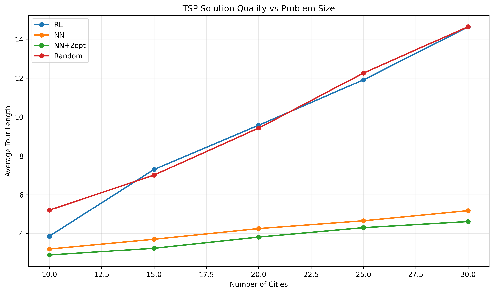
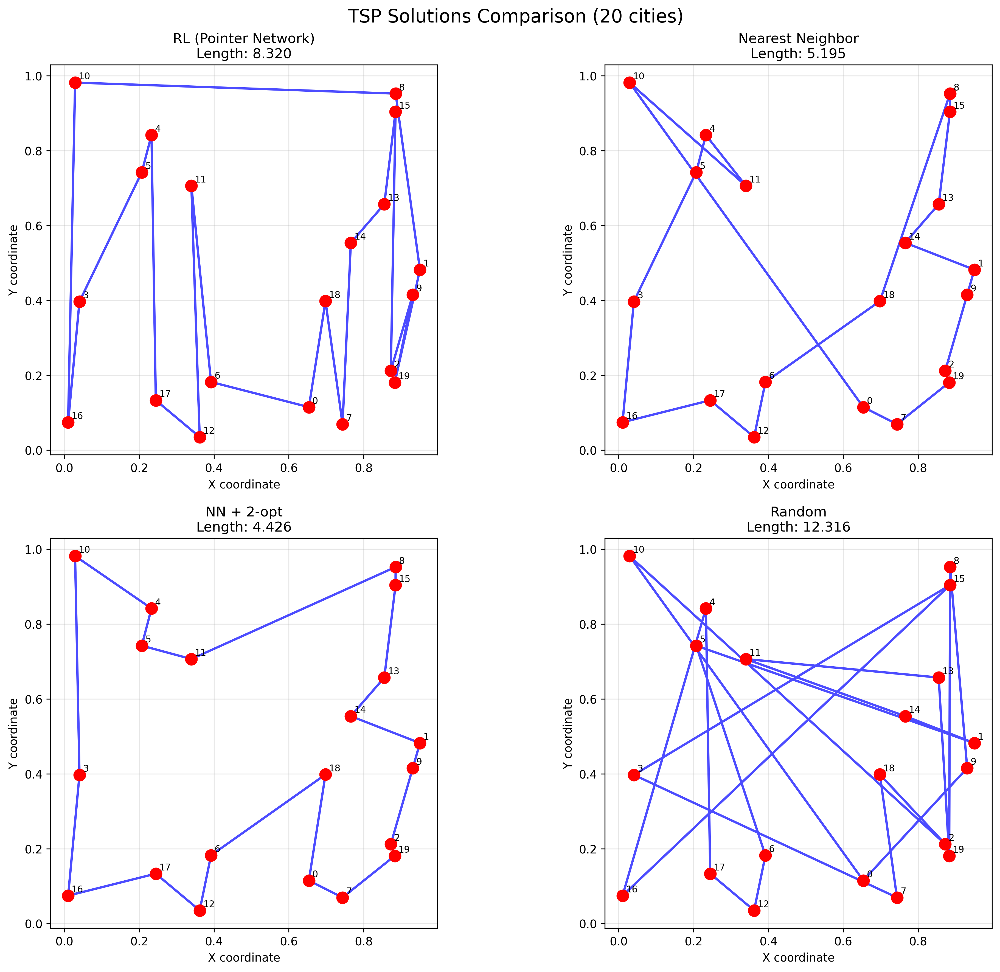
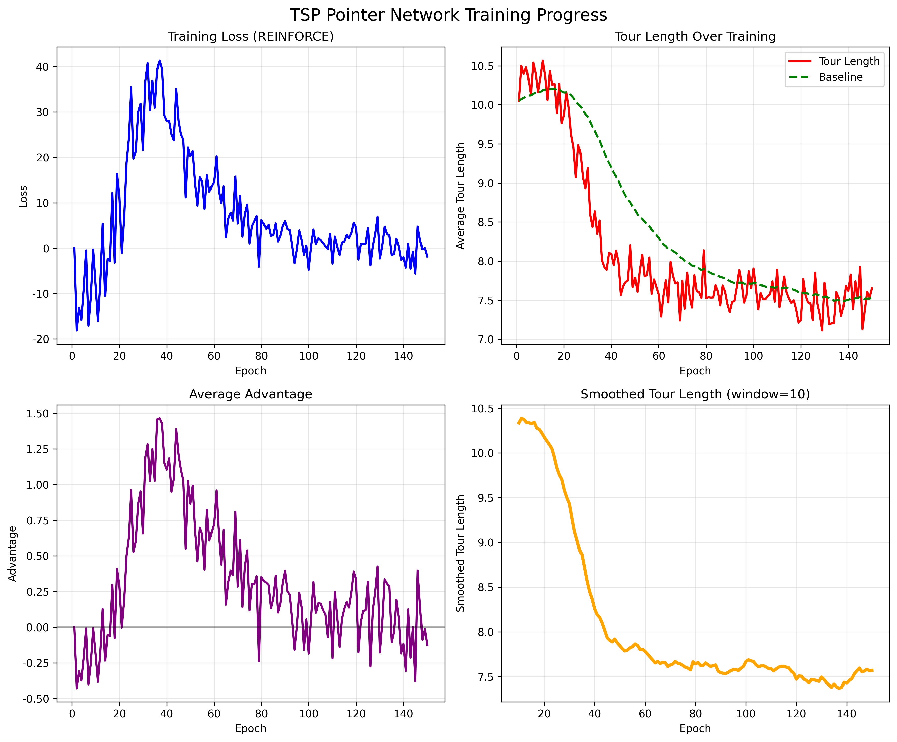

# Chapter 21: RL in Discrete Optimization

## Theory Summary

### Introduction to RL in Discrete Optimization

Deep reinforcement learning has historically been associated with game-playing applications, particularly since DeepMind's breakthrough on Atari games in 2015. However, this perception overlooks RL's broader applicability across diverse domains including stock trading, natural language processing, web navigation, continuous control, board games, and robotics. The flexible Markov Decision Process (MDP) model underlying RL makes it suitable for a wide variety of decision-making problems beyond gaming.

This chapter explores RL's application to **discrete optimization** - a branch of mathematics studying optimization problems on discrete structures. We focus specifically on the Rubik's cube puzzle, implementing the method described in McAleer et al.'s paper "Solving the Rubik's cube without human knowledge" using **autodidactic iteration (ADI)**.

### The Rubik's Cube and Discrete Optimization

#### Problem Complexity
The classic 3×3×3 Rubik's cube presents an enormous state space with approximately 4.33 × 10¹⁹ distinct reachable states. This complexity places it firmly in the domain of combinatorial optimization problems, alongside other famous challenges like:

- **Traveling Salesman Problem**: Finding shortest closed paths in graphs
- **Protein Folding Simulation**: Determining possible 3D protein structures  
- **Resource Allocation**: Optimal distribution of limited resources

These problems share the characteristic of massive state spaces that make brute-force approaches computationally infeasible.

#### Optimality and God's Number
A key concept in cube solving is **optimality** - finding the shortest possible solution sequence. While various solving methods exist (beginner's method requiring ~100 moves, Fridrich method requiring ~55 moves), the fundamental question concerns the minimal moves needed to solve any cube state.

In 2010, researchers proved that **God's number** - the minimum number of moves needed to solve any cube state - is 20. However, finding the actual optimal solution for any given state remains an open problem.

### Traditional Approaches vs RL Methods

#### Classical Methods
1. **Group Theory Approaches**: Using mathematical group theory to reduce state space (e.g., Kociemba's algorithm)
2. **Heuristic Search**: Brute-force search with manually crafted heuristics (e.g., Korf's algorithm using A* search with pattern databases)

#### Autodidactic Iteration (ADI)
McAleer et al. introduced a third approach using neural networks trained on randomly shuffled cubes. This method:
- Requires no prior domain knowledge
- Uses only a computer model of the cube
- Bears similarities to AlphaGo Zero's approach
- Employs Monte Carlo Tree Search (MCTS) to avoid full state space exploration

### State and Action Representation

#### Action Space
The cube has 12 possible actions (6 sides × 2 rotation directions):
- Clockwise rotations: R, L, T, D, F, B
- Counterclockwise rotations: r, l, t, d, f, b

Each action is mapped to a unique integer value for computational processing.

#### State Representation Challenges
Effective state representation must balance several objectives:
1. **Avoid redundancy**: Eliminate impossible states
2. **Memory efficiency**: Compact storage for large-scale processing
3. **Transformation performance**: Fast computation of state transitions
4. **NN friendliness**: Suitable input format for neural networks

#### Tensor Representation
The paper uses a 20 × 24 tensor with one-hot encoding:
- **20 tracked stickers**: 8 from top, 8 from bottom, 4 from sides
- **24 possible positions**: 
  - Corner cubelets: 8 positions × 3 orientations = 24
  - Side cubelets: 12 positions × 2 orientations = 24

This representation significantly reduces the state space compared to naive color encoding while maintaining sufficient information for solving.

### Neural Network Architecture

The network takes the 20 × 24 state tensor as input and produces two outputs:

1. **Policy Head**: 12-dimensional vector representing probability distribution over actions
2. **Value Head**: Single scalar estimating state "goodness"

The architecture consists of:
- Input: 20 × 24 tensor (flattened to 480 dimensions)
- Hidden layers: Fully connected layers with ELU activations
  - 4096 → 2048 units in body
  - Policy: 2048 → 512 → 12
  - Value: 2048 → 512 → 1

### Training Process: Autodidactic Iteration

The ADI training process works as follows:

1. **Data Generation**: Start from goal state, apply random transformations of length N
2. **State Expansion**: For each state s, apply all 12 possible transformations
3. **Target Calculation**:
   - Value target: yᵥⁱ = maxₐ(vₛ(a) + R(A(s,a)))
   - Policy target: yₚⁱ = argmaxₐ(vₛ(a) + R(A(s,a)))
   - Where R(s) = 1 if goal state, -1 otherwise

This generates training data by bootstrapping from the current network's predictions.

### Model Application with MCTS

Direct greedy policy application often fails due to:
- Imperfect network predictions
- Massive state space (network sees only tiny fraction during training)
- Local optima and misleading directions

**Monte Carlo Tree Search (MCTS)** addresses these issues by:
- Building a search tree incrementally
- Balancing exploration vs exploitation using Upper Confidence Bound
- Using network predictions to guide search toward promising regions

The action selection formula combines:
- Nₛₜ(a): Action visit count
- Pₛₜ(a): Network policy
- Wₛₜ(a): Maximum value from children

### Results and Performance

The DeepCube method achieves impressive results:
- **Training**: 44 hours on 3 GPUs, 8 billion cube states
- **Performance**: Solves all test cubes within 1 hour limit
- **Solution Quality**: Matches or beats Kociemba solver in 55% of cases
- **Solution Length**: Competitive with human-crafted solvers

### Implementation Architecture

The code employs a modular architecture:

1. **Cube Environment**: Abstract interface for different puzzle types
2. **Neural Network**: Model definition and training logic
3. **Solver**: MCTS implementation for solution finding
4. **Utilities**: Configuration, problem generation, and evaluation tools

### Experimental Improvements

The original method shows training instability, which can be addressed by:
- Modified value target calculation (zero for goal states)
- Better hyperparameter tuning
- Advanced network architectures
- Entropy regularization
- Priority replay buffers

## Code Implementation Breakdown

### Problem Definition: Traveling Salesman Problem

The code implements a Pointer Network solution for the Traveling Salesman Problem (TSP), demonstrating RL's applicability to combinatorial optimization.

#### TSP Instance Representation
```python
@dataclass
class TSPInstance:
    cities: np.ndarray          # [n_cities, 2] coordinates
    distances: np.ndarray       # [n_cities, n_cities] distance matrix
    n_cities: int
```

Key functionality includes:
- Random instance generation with controlled city placement
- Tour length calculation with cyclic return to start
- Visualization tools for solution analysis

### Pointer Network Architecture

#### Attention Mechanism
```python
class Attention(nn.Module):
    def __init__(self, hidden_dim: int):
        self.W_ref = nn.Linear(hidden_dim, hidden_dim, bias=False)
        self.W_q = nn.Linear(hidden_dim, hidden_dim, bias=False) 
        self.v = nn.Linear(hidden_dim, 1, bias=False)
```

The attention mechanism computes compatibility scores between:
- **Query**: Current decoder state
- **References**: All encoded city representations
- **Mask**: Prevents selection of already-visited cities

#### Complete Pointer Network
```python
class PointerNetwork(nn.Module):
    def __init__(self, input_dim: int = 2, hidden_dim: int = 128):
        self.encoder = nn.Sequential(...)          # City coordinate embedding
        self.decoder_lstm = nn.LSTMCell(hidden_dim, hidden_dim)
        self.attention = Attention(hidden_dim)
        self.decoder_start = nn.Parameter(...)     # Learnable initial state
```

The network operates through:
1. **Encoding**: Transform city coordinates to hidden representations
2. **Decoding**: LSTM-based sequential city selection
3. **Attention**: Compute selection probabilities over available cities
4. **Masking**: Enforce valid tours by tracking visited cities

### REINFORCE Training Algorithm

#### Training Step Implementation
```python
def train_step(self, batch_instances: List[TSPInstance]):
    # Generate tours and log probabilities
    log_probs, tours = self.model(cities_batch)
    
    # Calculate tour lengths (negative rewards)
    tour_lengths = [instance.tour_length(tour) for instance, tour in zip(batch_instances, tours)]
    
    # Update baseline (moving average)
    current_baseline = np.mean(tour_lengths)
    self.baseline = (1 - self.baseline_alpha) * self.baseline + self.baseline_alpha * current_baseline
    
    # Calculate advantages
    advantages = -(tour_lengths - self.baseline)  # Negative because we minimize length
    
    # REINFORCE loss
    loss = sum(-advantage * tour_log_prob for advantage, tour_log_prob in zip(advantages, log_probs))
```

Key components:
- **Policy Gradient**: ∇J(θ) = E[∑∇logπ(a|s) * A(s,a)]
- **Baseline**: Reduces variance using moving average of rewards
- **Advantage**: Difference between actual and expected performance

### Classical Heuristics for Comparison

The implementation includes traditional TSP methods:

1. **Nearest Neighbor**: Greedy local search
2. **2-opt Optimization**: Local improvement through edge swaps
3. **Random Baseline**: Stochastic solution generation

### Training Pipeline and Evaluation

#### Comprehensive Training Setup
```python
def train_tsp_solver(n_cities: int = 20, num_epochs: int = 200, batch_size: int = 32):
    solver = TSPSolver(hidden_dim=128, lr=1e-3)
    
    for epoch in range(num_epochs):
        # Generate random TSP instances
        batch_instances = [TSPInstance.random_instance(n_cities) for _ in range(batch_size)]
        
        # Training step
        stats = solver.train_step(batch_instances)
        
        # Logging and evaluation
```

The training process includes:
- Batch generation with varied problem instances
- Progressive learning with curriculum (increasing complexity)
- Comprehensive evaluation against classical baselines
- Visualization of learning progress and solution quality

### Advanced Features

#### Beam Search
```python
def _beam_search(self, tsp_instance: TSPInstance, cities_tensor: torch.Tensor, beam_width: int):
    # Maintain multiple candidate solutions
    beams = [{'tour': [], 'log_prob': 0.0, 'mask': ...}]
    
    # Expand beams while maintaining top-k candidates
    for step in range(n_cities):
        new_beams = []
        for beam in beams:
            # Generate possible next actions
            # Keep top-k expansions based on log probability
```

Beam search provides improved solution quality by:
- Maintaining multiple promising partial solutions
- Avoiding greedy local decisions
- Exploring diverse solution paths

#### Scalability Analysis
The code includes systematic evaluation across problem sizes:
- Performance comparison for 10-30 cities
- Learning curve analysis
- Solution quality vs computation time trade-offs

## Connection Between Theory and Code

### Common RL Principles in Different Domains

While the theory focuses on Rubik's cube and the code implements TSP, both demonstrate core RL principles for discrete optimization:

#### 1. State Representation and Encoding
**Theory (Rubik's Cube)**: 20×24 one-hot tensor encoding cubelet positions
**Code (TSP)**: 2D coordinate encoding with attention over city nodes

Both approaches transform discrete optimization states into neural network-friendly representations while preserving problem structure.

#### 2. Policy Learning and Action Selection
**Theory**: Neural network learns policy over 12 cube rotations
**Code**: Pointer network learns city selection policy through attention

Both methods use neural networks to learn complex decision policies in large discrete action spaces.

#### 3. Value Function Approximation
**Theory**: Value head estimates state "goodness" for cube configurations
**Code**: Implicit value through tour length minimization

Both approaches learn to estimate solution quality to guide search processes.

#### 4. Search and Planning Integration
**Theory**: MCTS with network guidance for cube solving
**Code**: Beam search and sampling for tour construction

Both combine learned policies with systematic search to overcome imperfect network predictions.

### Methodological Differences and Similarities

#### Training Approaches
**ADI (Theory)**: 
- Bootstrapped training from current network
- Self-play style data generation
- Value and policy updates from expanded states

**REINFORCE (Code)**:
- Policy gradient with baseline
- Direct optimization of tour length
- Batch training on random instances

#### Problem Characteristics
**Rubik's Cube**:
- Deterministic transitions
- Known goal state
- Large but finite state space
- All actions available at every state

**TSP**:
- Constructive solution building
- Sequential decision making with constraints
- Different problem instances
- Masking of invalid actions






