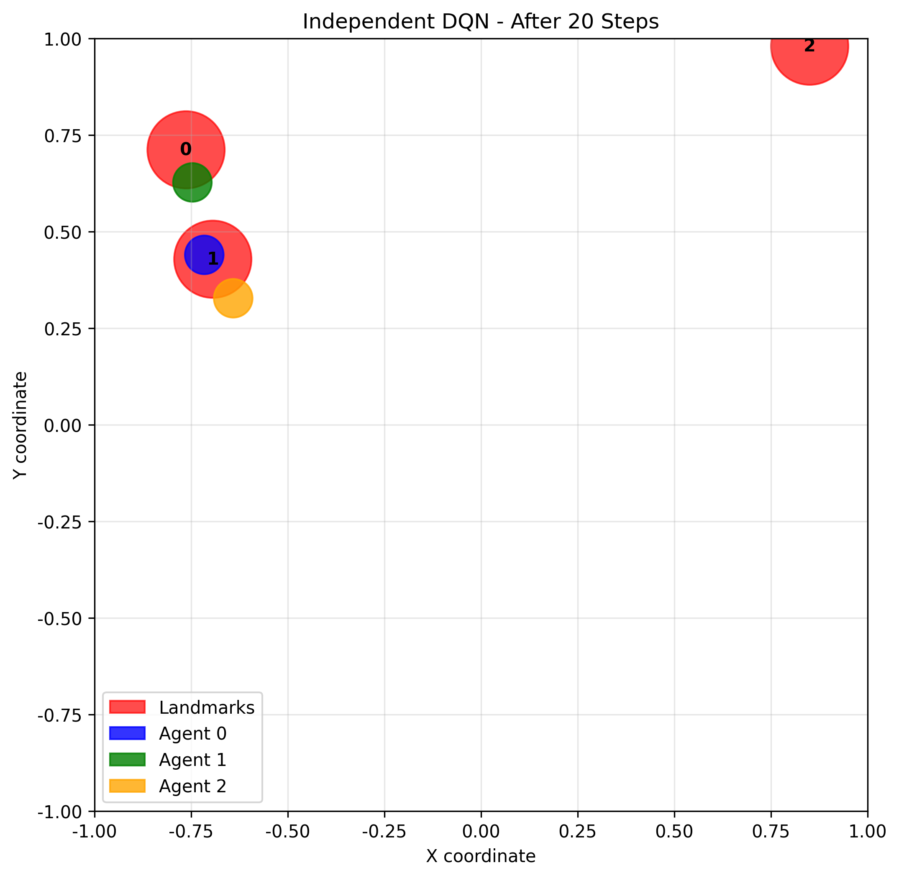

# Chapter 22: Multi-Agent RL

## Theory Summary

### Introduction to Multi-Agent Reinforcement Learning

Multi-Agent Reinforcement Learning (MARL) represents a significant extension of classical single-agent RL, addressing scenarios where multiple agents interact within a shared environment. While traditional RL focuses on a single agent's interaction with its environment, MARL deals with the complexities that arise when multiple decision-makers coexist and influence each other's outcomes.

#### Real-World Applications of MARL
MARL has practical applications across numerous domains:
- **Auctions and Market Simulations**: Modeling price changes and competitive advertising
- **Broadband Communication Networks**: Resource allocation and network optimization
- **Internet of Things (IoT)**: Coordinated device behavior and smart systems
- **Multiplayer Games**: Dota 2, StarCraft II, and other complex strategy games
- **Autonomous Systems**: Vehicle coordination, robot swarms, and traffic management

### Fundamental Concepts in MARL

#### Agent Interaction Types
MARL problems can be categorized based on the nature of agent interactions:

1. **Competitive Environments**:
   - Agents have conflicting objectives
   - Zero-sum or adversarial scenarios
   - Examples: Chess, Backgammon, Atari Pong
   - Characterized by minimax strategies and adversarial training

2. **Collaborative Environments**:
   - Agents share common goals
   - Require coordination and cooperation
   - Examples: Multi-robot coordination, team sports
   - Involve credit assignment and shared reward structures

3. **Mixed-Motive Environments**:
   - Combination of competitive and collaborative elements
   - Most real-world scenarios fall into this category
   - Examples: Corporate environments, political negotiations

#### Emergent Behavior in MARL
Research has demonstrated that groups of simple agents can develop surprisingly complex collaborative behaviors. Notable examples include:
- OpenAI's "hide-and-seek" environment where agents developed sophisticated strategies like building fences and using trampolines
- Emergent tool use from multi-agent autocurricula
- Self-organizing behaviors in predator-prey simulations

### The MAgent Environment Framework

#### Environment Overview
MAgent provides a scalable 2D grid-world simulation framework with the following key features:
- **Scalability**: Built in C++ with Python bindings, supporting thousands of agents
- **Flexible Agent Groups**: Configurable agent types with different characteristics
- **Rich Observation Space**: Grid-based perception with multiple information planes
- **Complex Interactions**: Configurable attack, movement, and health mechanics

#### Installation and Setup
MAgent2 (maintained by The Farama Foundation) can be installed via:
```bash
pip install magent2==0.3.3
```

#### Forest Environment Configuration
The predator-prey scenario ("tigers" vs "deer") demonstrates key MARL concepts:

**Observation Structure**:
- **9×9×5 tensor for tigers**, 3×3×5 for deer (different perception ranges)
- **Five observation planes**:
  1. Walls: Binary indicator of obstacle presence
  2. Own Group: Presence of agents from the same group
  3. Own Group Health: Relative health of same-group agents
  4. Enemy Group: Presence of opposing agents
  5. Enemy Group Health: Health status of enemy agents

**Action Spaces**:
- **Deer**: 5 actions (4 directions + no-op)
- **Tigers**: 9 actions (4 directions + 4 attack directions + no-op)

**Agent Dynamics**:
- Tigers lose 0.1 health per step, gain 8 health per deer eaten
- Deer lose health only when attacked, gain health over time
- Environment supports dynamic agent populations (agents can die and be removed)

### Training Approaches in MARL

#### Independent DQN (IDQN)
The simplest MARL approach where each agent learns independently:
- Each agent maintains its own Q-network
- Treats other agents as part of the environment
- Suffers from non-stationarity issues but is computationally efficient

#### Multi-Agent Deep Deterministic Policy Gradient (MADDPG)
A more sophisticated approach addressing MARL challenges:

**Key Innovations**:
- **Centralized Training with Decentralized Execution**: Critics have access to all agents' observations and actions during training, but actors only use local information during execution
- **Addresses Non-Stationarity**: By conditioning critics on all agents' actions, the environment becomes stationary from the critic's perspective
- **Stable Learning**: Target networks and experience replay mitigate training instability

**Mathematical Foundation**:
For each agent i, the centralized action-value function is:
Q_i(o, a₁, ..., a_N) where o = (o₁, ..., o_N) are all agents' observations

The policy gradient for agent i is:
∇J(θ_i) = E[∇θ_i log π_i(a_i|o_i) Q_i(o, a₁, ..., a_N)]

### Advanced MARL Concepts

#### Non-Stationarity Problem
In single-agent RL, the environment is stationary (transition probabilities don't change). In MARL, as other agents learn, the environment becomes non-stationary from any single agent's perspective. This violates the Markov assumption and can destabilize learning.

#### Credit Assignment Problem
In cooperative settings, determining each agent's contribution to team success is challenging. Sparse team rewards make it difficult for agents to learn which actions are beneficial.

#### Communication and Coordination
Agents may need to develop communication protocols or implicit coordination strategies. This can emerge naturally through learning or be explicitly designed into the architecture.

### Experimental Results and Insights

#### Tiger Training with DQN
- **Performance**: Trained tigers achieved average rewards of 82, significantly outperforming random policies
- **Hunting Efficiency**: Best policies captured ~76% of deer (155 out of 204)
- **Training Dynamics**: Rapid improvement in first 300 episodes, followed by slower refinement
- **Limitations**: Limited perception range constrained final performance

#### Collaborative Tiger Hunting
The "double_attack" mode required tigers to coordinate attacks:
- **Increased Complexity**: Significantly harder learning problem
- **Emergent Coordination**: Tigers learned to move and attack in pairs
- **Training Challenges**: Required longer training times and showed less stable learning curves

#### Competitive Co-Training
Training both tigers and deer simultaneously revealed:
- **Arms Race Dynamics**: Continuous adaptation between predator and prey
- **Deer Advantage**: With equal speed, deer could often survive by continuous movement
- **Policy Specialization**: Each group developed specialized evasion or hunting strategies

#### Battle Environment
The symmetric combat scenario demonstrated:
- **Tactical Behavior**: Learned positioning and timing of attacks
- **Training Instability**: Common challenge in competitive MARL
- **Transferable Skills**: Policies that generalized across similar combat situations

### Challenges and Future Directions

#### Current Limitations
1. **Scalability**: Methods that work well with few agents may not scale to large populations
2. **Sample Efficiency**: MARL typically requires more samples than single-agent RL
3. **Theoretical Foundations**: Less developed than single-agent RL theory
4. **Evaluation Metrics**: Standardized benchmarks and evaluation protocols are still evolving

#### Promising Research Directions
- **Hierarchical MARL**: Multi-level organization of agent behaviors
- **Transfer Learning**: Leveraging knowledge across different multi-agent tasks
- **Explainable MARL**: Understanding emergent behaviors and coordination strategies
- **Safe MARL**: Ensuring desirable system-level behaviors

## Code Implementation Breakdown

### Environment Implementation: SimpleSpread

The code implements a cooperative multi-agent environment where agents must cover landmarks while avoiding collisions:

```python
class SimpleSpreadEnvironment:
    def __init__(self, num_agents=3, num_landmarks=3, world_size=2.0):
        self.num_agents = num_agents
        self.num_landmarks = num_landmarks
        self.world_size = world_size
        self.action_space = 5  # [no_action, move_left, right, up, down]
```

**Key Environment Features**:
- **Cooperative Objective**: Agents receive rewards for being closest to landmarks
- **Collision Penalties**: Negative rewards for agent collisions
- **Time Penalties**: Small negative reward per step to encourage efficiency
- **Bounded World**: Agents cannot leave the defined world boundaries

**Observation Structure**:
Each agent receives observations containing:
- Its own position
- Relative positions of other agents
- Relative positions of all landmarks

### Independent DQN Implementation

#### DQN Agent Architecture
```python
class DQNAgent:
    def __init__(self, obs_dim, action_dim, hidden_dim=64, lr=1e-3):
        self.q_network = nn.Sequential(
            nn.Linear(obs_dim, hidden_dim),
            nn.ReLU(),
            nn.Linear(hidden_dim, hidden_dim),
            nn.ReLU(),
            nn.Linear(hidden_dim, action_dim)
        )
```

**Training Components**:
- **Experience Replay**: Each agent maintains its own replay buffer
- **Target Networks**: Periodic updates for training stability
- **Epsilon-Greedy Exploration**: Decaying exploration rate
- **Independent Learning**: No sharing of experiences or gradients between agents

#### Training Loop for IDQN
```python
def train_independent_dqn(num_episodes=2000):
    agents = [DQNAgent(obs_dim, action_dim) for _ in range(env.num_agents)]
    
    for episode in range(num_episodes):
        observations = env.reset()
        while not done:
            # Each agent selects action independently
            actions = [agent.select_action(obs) for agent, obs in zip(agents, observations)]
            next_observations, rewards, done, info = env.step(actions)
            
            # Store experiences independently
            for i, agent in enumerate(agents):
                agent.store_experience(observations[i], actions[i], rewards[i], next_observations[i], done)
            
            # Train agents independently
            for agent in agents:
                agent.train()
```

### MADDPG Implementation

#### Actor-Critic Architecture

**Actor Network**:
```python
class Actor(nn.Module):
    def __init__(self, obs_dim, action_dim, hidden_dim=64):
        super(Actor, self).__init__()
        self.network = nn.Sequential(
            nn.Linear(obs_dim, hidden_dim), nn.ReLU(),
            nn.Linear(hidden_dim, hidden_dim), nn.ReLU(),
            nn.Linear(hidden_dim, action_dim),
            nn.Softmax(dim=-1)  # Policy output
        )
```

**Centralized Critic**:
```python
class Critic(nn.Module):
    def __init__(self, total_obs_dim, total_action_dim, hidden_dim=128):
        super(Critic, self).__init__()
        self.network = nn.Sequential(
            nn.Linear(total_obs_dim + total_action_dim, hidden_dim),
            nn.ReLU(),
            nn.Linear(hidden_dim, hidden_dim),
            nn.ReLU(),
            nn.Linear(hidden_dim, 1)  # Q-value output
        )
```

#### MADDPG Training Algorithm

**Centralized Training**:
```python
def train(self, batch_size=64):
    # Sample batch from shared replay buffer
    batch = random.sample(self.memory, batch_size)
    
    for agent_idx, agent in enumerate(self.agents):
        # Critic update with all agents' observations and actions
        current_obs = obs_batch.view(batch_size, -1)  # Flatten all observations
        current_actions = torch.cat([F.one_hot(action_batch[:, i], ...) for i in range(self.num_agents)], dim=1)
        
        current_q_values = agent.critic(current_obs, current_actions)
        
        # Actor update with other agents' actions fixed
        policy_actions = []
        for i, policy_agent in enumerate(self.agents):
            if i == agent_idx:
                policy_action_probs = agent.actor(obs_batch[:, i])
            else:
                with torch.no_grad():  # Other agents' policies fixed during update
                    policy_action_probs = policy_agent.actor(obs_batch[:, i])
            policy_actions.append(policy_action_probs)
        
        policy_actions_combined = torch.cat(policy_actions, dim=1)
        actor_loss = -agent.critic(current_obs, policy_actions_combined).mean()
```

**Key MADDPG Features**:
- **Shared Experience Replay**: All agents contribute to a common replay buffer
- **Centralized Critics**: Each agent's critic sees all observations and actions
- **Decentralized Actors**: Each agent's actor uses only local observations
- **Target Networks**: Soft updates for both actor and critic networks
- **Exploration Noise**: Added to actions during training, removed during evaluation

### Evaluation and Comparison Framework

#### Performance Metrics
The implementation tracks multiple metrics:
- **Average Episode Reward**: Primary performance indicator
- **Landmark Coverage**: Percentage of landmarks with nearby agents
- **Collision Count**: Number of agent-agent collisions
- **Training Stability**: Loss curves and advantage values

#### Comparative Analysis
```python
def compare_multi_agent_methods():
    # Train both IDQN and MADDPG
    idqn_results = train_independent_dqn()
    maddpg_results = train_maddpg()
    
    # Comprehensive evaluation on test episodes
    idqn_test_rewards = evaluate_agents(idqn_agents, idqn_env)
    maddpg_test_rewards = evaluate_agents(maddpg_agents, maddpg_env)
```

## Connection Between Theory and Code

### Bridging MAgent Theory and SimpleSpread Implementation

While the theoretical discussion focuses on MAgent environments and the code implements a simpler spread environment, both demonstrate core MARL principles:

#### 1. Non-Stationarity Challenges
**Theory**: In MAgent, as tigers learn better hunting strategies, the environment changes for deer, creating a moving target for learning.

**Code Implementation**: In SimpleSpread, as agents learn better coverage strategies, the optimal response for other agents changes. IDQN suffers from this non-stationarity, while MADDPG's centralized critics help stabilize learning.

#### 2. Credit Assignment in Cooperative Tasks
**Theory**: In collaborative tiger hunting (double_attack mode), determining which tiger deserves credit for a successful hunt is challenging.

**Code Implementation**: In SimpleSpread, the reward function gives credit to the closest agent for each landmark, but MADDPG's centralized critic can learn more nuanced credit assignment through the Q-function.

#### 3. Emergent Coordination
**Theory**: MAgent tigers developed pair-hunting behaviors without explicit coordination mechanisms.

**Code Implementation**: MADDPG agents in SimpleSpread learn implicit coordination strategies through the centralized critic that sees all agents' actions.

### Algorithmic Connections

#### Independent DQN Correspondence
**Theory Context**: The initial tiger training with DQN represents the simplest MARL approach where each agent learns independently.

**Code Implementation**: The `DQNAgent` class implements this independent learning paradigm, demonstrating both its simplicity and limitations.

#### MADDPG Theoretical Foundations
**Theory Principles**: Centralized training with decentralized execution addresses non-stationarity by conditioning value functions on all agents' actions.

**Code Implementation**: The `MADDPG` class implements this exactly - critics receive concatenated observations and actions during training, while actors use only local information.

### Environment Design Parallels

#### Observation Structures
**MAgent**: Multi-plane grid observations with relative positioning
**SimpleSpread**: Vector observations with relative coordinates

Both environments provide agents with information about other agents' positions, enabling the development of coordination strategies.

#### Reward Engineering
**MAgent**: Complex reward structures with health management, attack rewards, and step penalties
**SimpleSpread**: Simpler but analogous rewards for coverage, with penalties for collisions and time

Both demonstrate the importance of reward design in shaping emergent behaviors.

### Training Insights and Challenges

#### Non-Stationarity Manifestations
**Theory**: MAgent training showed oscillating performance as predator and prey adapted to each other.

**Code**: Both IDQN and MADDPG exhibit training instability, but MADDPG shows better convergence due to its centralized critics.

#### Scalability Considerations
**Theory**: MAgent supports thousands of agents but training becomes computationally challenging.

**Code**: The current implementation focuses on small agent populations (3 agents) but the architecture supports scaling.

### Advanced Concept Implementations

#### Centralized Training Infrastructure
The MADDPG implementation demonstrates several advanced MARL concepts:

1. **Parameter Sharing**: While each agent has its own actor and critic, the training process coordinates updates
2. **Experience Sharing**: The shared replay buffer allows agents to learn from each other's experiences
3. **Stabilized Learning**: Target networks and soft updates prevent training divergence

#### Multi-Agent Credit Assignment
The code implements implicit credit assignment through:
- Landmark-based rewards that naturally assign credit to closest agents
- The centralized critic learning to value coordinated actions
- The advantage calculation in REINFORCE that compares individual performance to baseline





